# Architecture 4+1 — BrokerX

Ce document présente l’architecture du projet BrokerX selon l’approche 4+1 vues, avec pour chaque vue : un diagramme (référence à l’image) et une explication détaillée du contexte, des éléments, des relations et du rationnel.

---

## 1. Vue Scénarios

### Diagramme
- 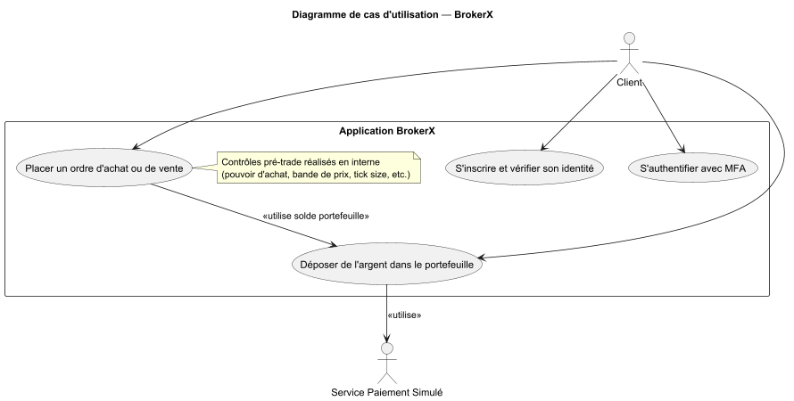

### Contexte
La vue scénarios expose les principaux cas d’utilisation du système BrokerX, tels qu’ils sont vécus par les utilisateurs et les systèmes externes. Elle permet de visualiser les interactions entre le client et l’application, ainsi que les dépendances fonctionnelles entre les différents UC.

### Éléments
- Acteurs externes : Client (utilisateur principal), Service Paiement Simulé (pour le dépôt)
- Cas d’utilisation : Inscription & vérification d’identité, Authentification & MFA, Dépôt dans le portefeuille, Placement d’un ordre

### Relations
- Le client peut initier chacun des cas d’utilisation
- Le dépôt utilise le service de paiement simulé
- Le placement d’un ordre dépend du solde du portefeuille

### Rationnel
Cette vue permet de relier les besoins métier aux fonctionnalités du système, de valider la couverture fonctionnelle et d’illustrer les interactions principales. Elle sert de point de départ pour la modélisation des autres vues et garantit que l’architecture répond bien aux attentes des utilisateurs et des parties prenantes. Elle facilite aussi la communication entre les équipes métier et technique, en offrant une vision synthétique des parcours utilisateurs et des dépendances fonctionnelles. Enfin, elle permet d’identifier rapidement les points d’intégration et les scénarios critiques à tester.

---

## 2. Vue Logique

### Diagramme
- 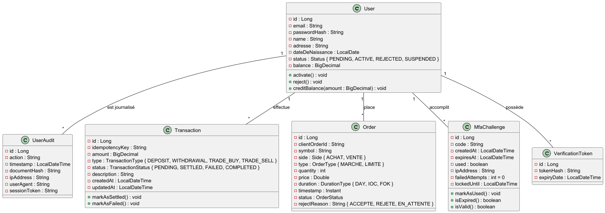

### Contexte
La vue logique présente la structure interne du système, centrée sur le modèle métier et les entités du domaine. Elle met en avant la modélisation des concepts clés, leur organisation et leurs relations.

### Éléments
- Classes métier : User, Transaction, Order, MfaChallenge, VerificationToken, UserAudit
- Enums et value objects utilisés dans le domaine
- Relations entre les entités (composition, agrégation, associations)

### Relations
- Les entités sont liées par des relations métier (ex : un User effectue des Transactions, place des Orders, etc.)
- Les enums et value objects enrichissent la sémantique métier

### Rationnel
Cette vue permet de comprendre la logique métier profonde du système, d’assurer la cohérence du modèle et de faciliter la maintenance et l’évolution du code. Elle sert de base à la validation des règles métier et à la conception des services applicatifs. En explicitant les dépendances et les relations entre les entités, elle aide à anticiper les impacts des évolutions fonctionnelles et à garantir la robustesse du modèle. Elle est aussi essentielle pour la documentation, la formation des nouveaux développeurs et la communication avec les parties prenantes métier.

---

## 3. Vue Processus (C&C)

### Diagrammes

#### UC01 — Séquence
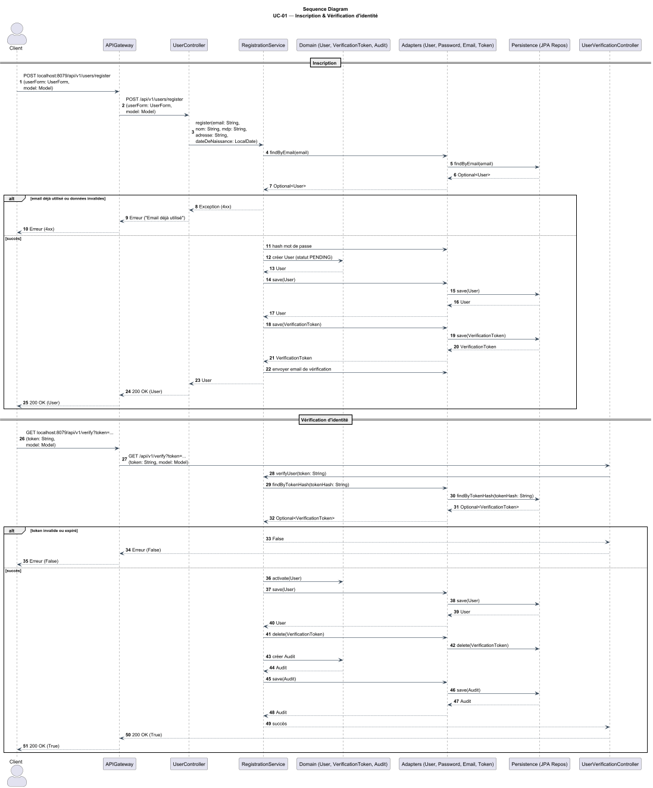

#### UC01 — Activité
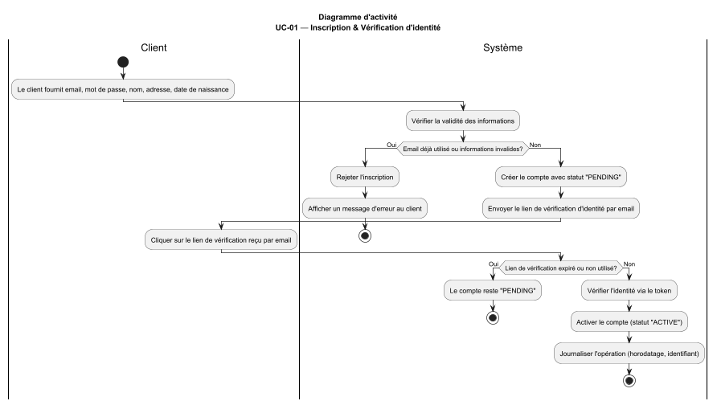

#### UC02 — Séquence
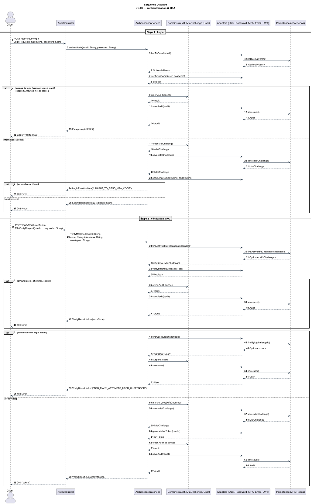

#### UC02 — Activité
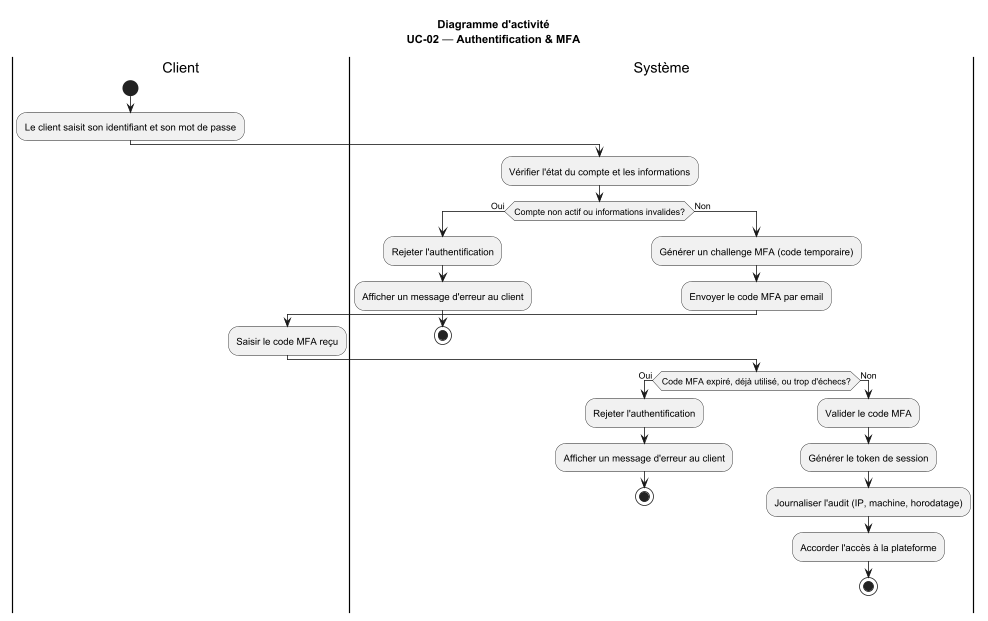

#### UC03 — Séquence
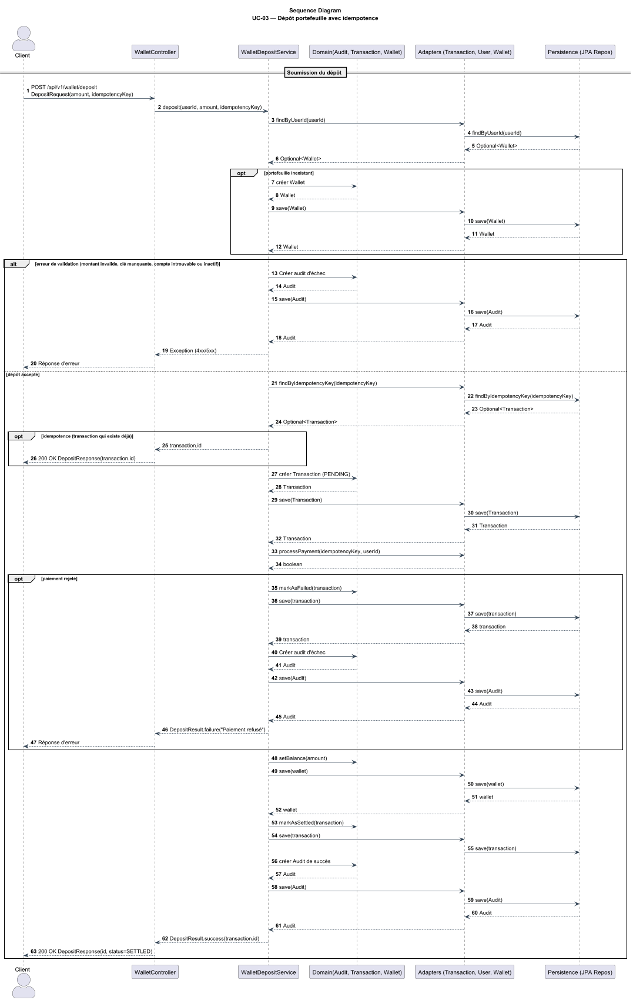

#### UC03 — Activité
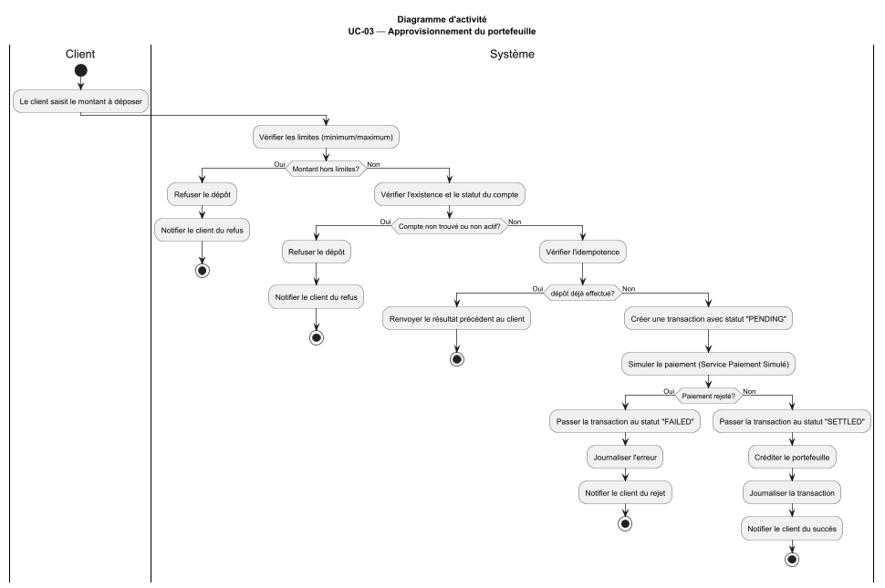

#### UC05 — Séquence
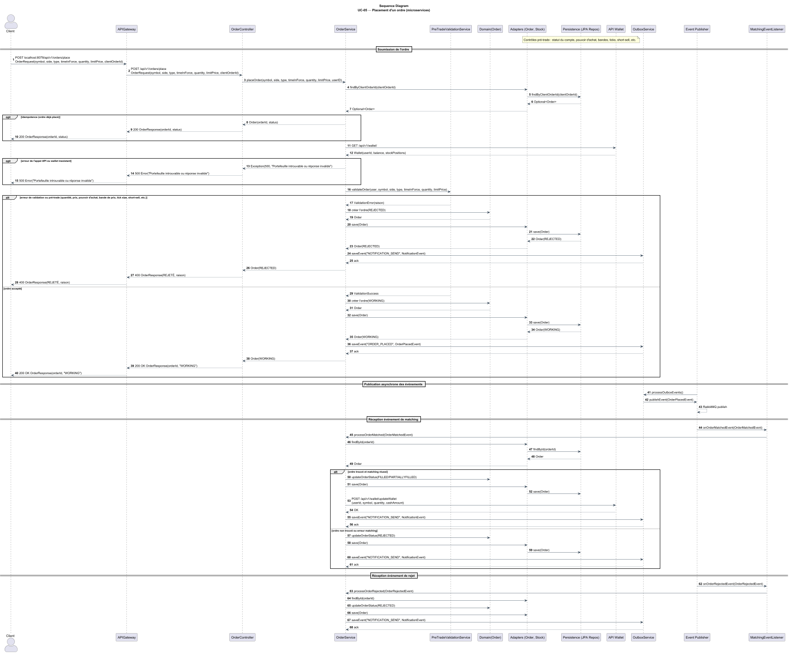

#### UC05 — Activité
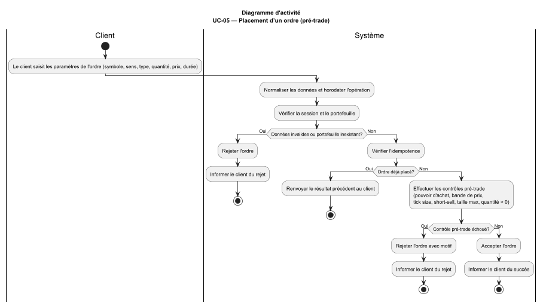

### Contexte
La vue processus détaille le comportement dynamique du système lors de l’exécution des cas d’utilisation. Elle montre comment les composants collaborent pour réaliser les opérations métier, gérer les erreurs et orchestrer les interactions.

### Éléments
- Services applicatifs (RegistrationService, AuthService, WalletService, OrderService)
- Contrôleurs web (UserController, AuthController, WalletController, OrderController)
- Adapters (UserAdapter, TransactionAdapter, etc.)
- Persistance (JPA Repos)
- Acteurs externes (Client)

### Relations
- Les contrôleurs reçoivent les requêtes des clients et délèguent aux services
- Les services orchestrent la logique métier et interagissent avec les adapters
- Les adapters font le lien avec la persistance et les systèmes externes
- Les diagrammes d’activité synthétisent les étapes clés et les alternatives

### Rationnel
Cette vue permet de visualiser le flow des opérations, la gestion des exceptions, l’idempotence et la coordination entre les modules. Elle est essentielle pour valider la robustesse, la sécurité et la performance du système lors des opérations critiques. Elle aide à identifier les points de synchronisation, les risques de concurrence, et à optimiser la répartition des responsabilités. Elle est aussi précieuse pour l’analyse des scénarios d’erreur, la traçabilité des actions et la préparation des tests d’intégration et de non-régression.

---

## 4. Vue Développement

### Diagrammes
- 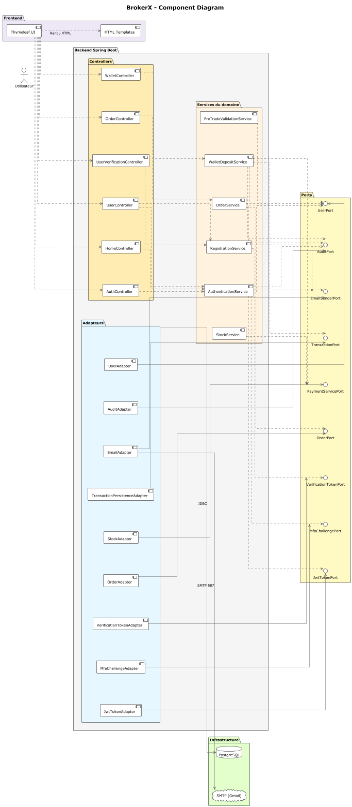
- 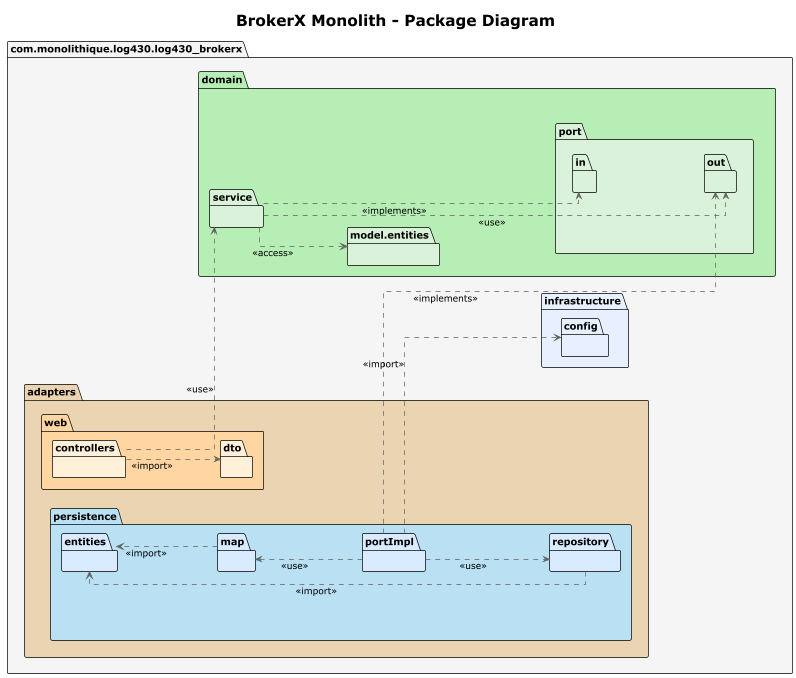

### Contexte
La vue développement présente l’organisation du code source, la structure des dossiers, la modularité et les dépendances internes. Elle met en avant la façon dont le projet est découpé pour faciliter le travail des développeurs.

### Éléments
- Packages principaux : adapters, domain, infrastructure
- Composants techniques : contrôleurs, services, adapters, ports
- Structure des dossiers et conventions de nommage

### Relations
- Les packages sont organisés selon l’architecture hexagonale
- Les dépendances entre modules sont explicites et maîtrisées
- Les conventions facilitent la maintenance et l’évolution

### Rationnel
Cette vue facilite la compréhension du projet pour les développeurs, la maintenance et l’évolution du code. Elle favorise la modularité, la réutilisabilité et la robustesse de l’application. Elle permet d’anticiper les impacts des changements, d’améliorer la qualité du code et de réduire les risques de dette technique. Elle est aussi utile pour l’onboarding, la gestion des versions et la collaboration entre équipes.

---

## 5. Vue Déploiement

### Diagramme
- 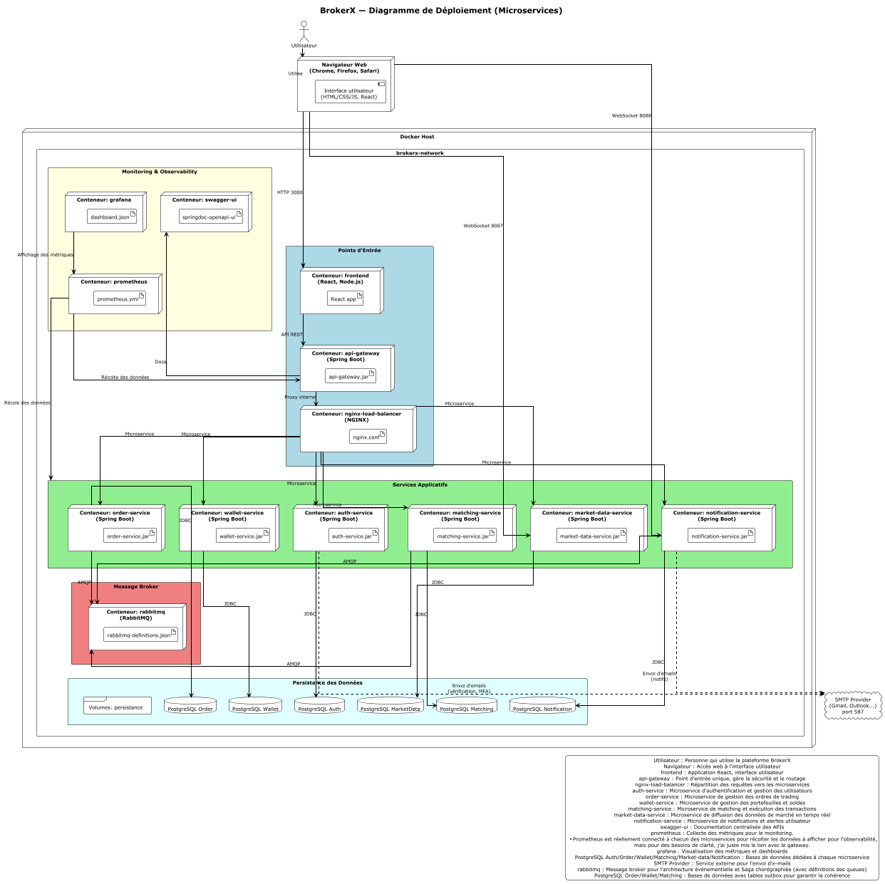

### Contexte
La vue déploiement décrit l’architecture physique du système : comment les composants sont déployés sur l’infrastructure réelle (VM, Docker, réseau, base de données, services externes).

### Éléments
- Conteneur applicatif Spring Boot
- Base de données PostgreSQL
- Service SMTP externe
- Volumes et réseaux Docker

### Relations
- L’application communique avec la base de données via JDBC
- Les emails sont envoyés via le service SMTP externe
- Les volumes assurent la persistance des données
- Le réseau Docker isole et sécurise les communications

### Rationnel
Cette vue permet de comprendre la topologie du système, les points d’intégration, la sécurité et la résilience de l’application BrokerX en production. Elle est essentielle pour la gestion des déploiements, la scalabilité et la supervision. Elle aide à anticiper les besoins d’infrastructure, à optimiser la disponibilité et à garantir la conformité aux exigences de sécurité et de performance. Elle facilite aussi la gestion des incidents, la reprise après sinistre et l’évolution de l’architecture technique.

---

# Conclusion
Ce document 4+1 synthétise l’architecture de BrokerX à travers ses vues essentielles : scénarios, logique, processus, développement et déploiement. Chaque section combine diagramme et explication pour garantir la compréhension, la traçabilité et la robustesse du système.
