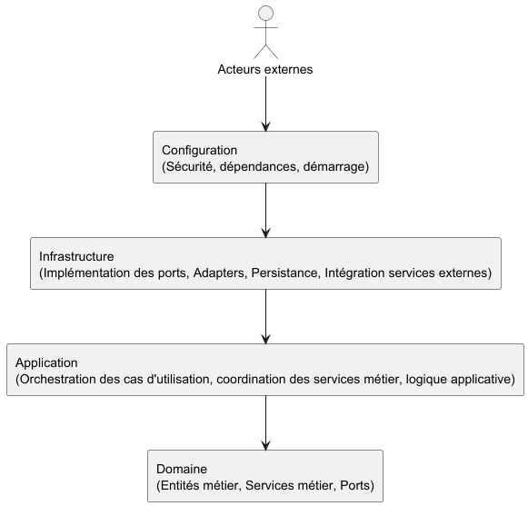

# Architecture de BrokerX

## 1. Choix du style architectural

BrokerX adopte une **architecture hexagonale (Ports & Adapters)**.

### Justification du choix
- **Séparation stricte du domaine métier** : Le cœur métier (modèles, services, logique métier) est isolé des dépendances techniques (frameworks, bases de données, API externes). Les règles métier restent stables et compréhensibles, même si la technologie évolue.
- **Évolutivité et adaptabilité** : L’architecture hexagonale facilite l’ajout ou le remplacement de services externes (paiement, données de marché, audit) sans impacter le domaine. Par exemple, un changement de fournisseur de paiement n’affecte que l’adapter correspondant.
- **Facilité de test et de validation métier** : Le découplage permet de tester le domaine indépendamment des frameworks, ce qui accélère la validation métier et la détection des régressions. Les ports facilitent la création de mocks pour les tests unitaires et d’intégration.
- **Dépendances dirigées et absence de cycles** : Les dépendances sont orientées du domaine vers les ports, puis vers les adapters, ce qui évite les cycles et rend l’architecture plus robuste et maintenable.
- **Réduction du couplage** : Le domaine ne dépend jamais de l’infrastructure ou des frameworks, ce qui permet de migrer vers une autre technologie (ex : changement de framework, passage à une architecture microservices) sans refonte du métier.
- **Conformité réglementaire et sécurité** : En isolant le métier, on facilite la traçabilité et la conformité (audit, KYC, MFA), car les règles métier sont centralisées et documentées.
- **Clarté et communication** : Ce style favorise une documentation claire et une compréhension partagée entre les équipes métier et technique, car chaque couche a une responsabilité bien définie.

Ce style répond aux besoins de BrokerX : évolutivité, conformité réglementaire, sécurité, intégration de nouveaux services externes, et robustesse face aux changements technologiques.

---

## 1.1. Architecture monolithique et évolutivité

BrokerX est une application monolithique : toutes les fonctionnalités métier, la logique applicative et l’intégration technique sont regroupées dans un même déploiement.
- **Un seul artefact déployé** : toutes les couches (domaine, application, infrastructure, configuration) sont assemblées et exécutées ensemble, ce qui simplifie la gestion et la supervision.
- **Centralisation des règles métier** : la logique métier et les processus sont gérés dans un même espace, ce qui facilite la cohérence et la traçabilité.
- **Gestion transactionnelle fiable** : les opérations complexes (dépôt, placement d’ordre, audit) bénéficient d’une gestion transactionnelle robuste, sans complexité distribuée.
- **Modularité interne** : chaque couche et chaque port/adaptateur est clairement séparé, ce qui permet d’ajouter, modifier ou remplacer des modules sans impacter le reste du système.
- **Préparation à la modularisation** : les ports et adapters peuvent être extraits vers des microservices ou modules indépendants si le besoin de scalabilité ou d’évolution se présente.
- **Facilité d’intégration de nouveaux services** : l’ajout de services externes (paiement, données de marché, audit) se fait via de nouveaux adapters, sans toucher au domaine métier.
- **Clarté et robustesse** : la séparation stricte des responsabilités rend le code plus lisible, plus maintenable et facilite l’intégration de nouveaux développeurs.

Ainsi, BrokerX combine la simplicité et la robustesse du monolithe avec la modularité et l’évolutivité de l’architecture hexagonale.

---

## 2. Description des couches et dépendances

L’architecture se compose des couches suivantes :
- **Domaine** : Entités métier (User, Order, Transaction, Stock…), services métier, ports (interfaces du domaine). Cette couche porte la logique métier, les règles de validation, et les invariants du système.
- **Application** : Orchestration des cas d’utilisation, coordination des services métier, gestion de la logique applicative. Elle fait le lien entre les besoins métier et les interactions techniques, sans dépendre des frameworks.
- **Infrastructure** : Implémentation des ports (adapters), persistance, sécurité, intégration avec les services externes. Cette couche traduit les besoins métier en opérations techniques (accès base de données, appels API, gestion de la sécurité).
- **Configuration** : Paramétrage de la sécurité, des dépendances, et du démarrage de l’application. Elle assemble les composants, injecte les dépendances, et gère l’environnement d’exécution.

### Organisation des dépendances
- Le domaine reste totalement indépendant des frameworks et de l’infrastructure, ce qui garantit sa stabilité et sa portabilité.
- Les ports définissent les points d’extension et d’intégration ; les adapters les implémentent pour chaque technologie ou service externe.
- La configuration injecte les dépendances sans créer de cycles, ce qui permet de maîtriser l’ordre d’initialisation et la gestion des ressources.
- Les dépendances sont toujours dirigées, ce qui évite les effets de bord et facilite la maintenance.

---

## 3. Contrôle du couplage aux frameworks

- Le couplage aux frameworks (Spring, persistance, sécurité) est strictement limité à l’infrastructure et à la configuration. Cela permet de changer de framework ou de technologie sans impacter le métier.
- Le domaine ne contient aucune annotation ou dépendance technique, ce qui garantit sa pureté et sa testabilité.
- Le cœur métier peut être réutilisé ou migré vers une autre architecture (microservices, serverless) sans dépendance forte, ce qui protège l’investissement métier.
- Les tests sont facilités, car le domaine peut être mocké ou simulé sans dépendance technique.

---

## 4. Illustration de l’architecture

---

## 5. Justification globale

L’architecture hexagonale appliquée au monolithe BrokerX :
- Permet de faire évoluer la plateforme sans refonte majeure, en isolant le métier des choix techniques.
- Sécurise le domaine contre les changements techniques et réglementaires, en centralisant les règles métier.
- Facilite l’intégration de nouveaux services externes (paiement, données de marché, audit) grâce aux ports et adapters.
- Répond aux exigences de clarté, évolutivité et conformité de l’analyse métier, tout en favorisant la communication entre les équipes.
- Garantit la robustesse et la maintenabilité du système, en évitant les cycles et en maîtrisant les dépendances.
- Prépare la plateforme à une éventuelle migration vers une architecture distribuée ou microservices, sans perte de logique métier.
