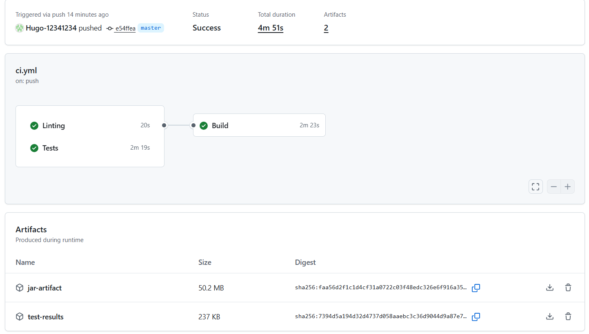
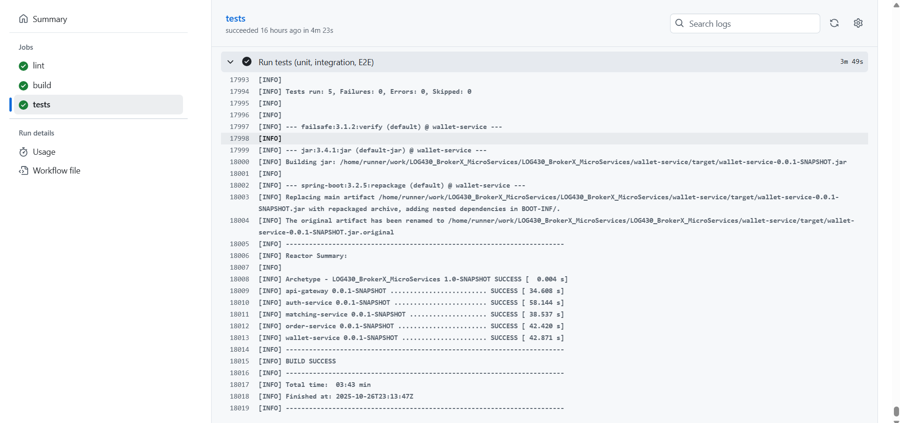
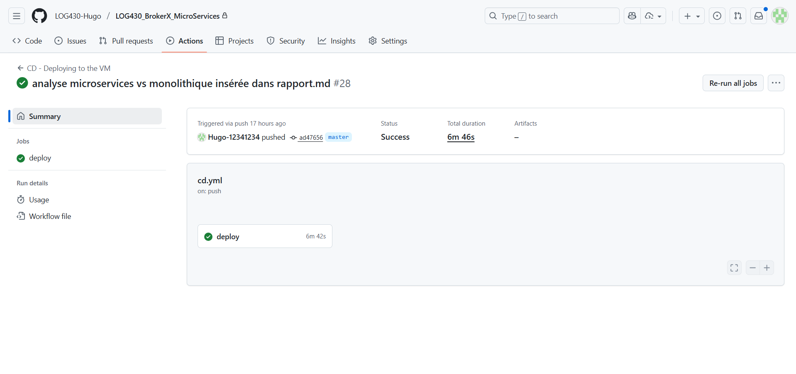
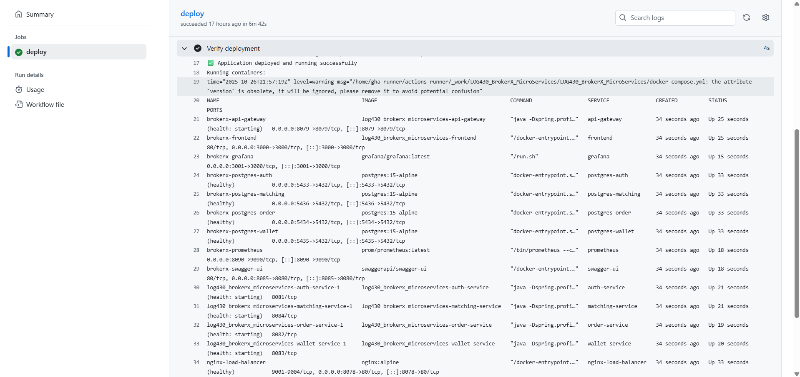

# Table des matières
- [Table des matières](#table-des-matières)
- [Début de la documentation arc42](#début-de-la-documentation-arc42)
- [1. Introduction \& Objectifs](#1-introduction--objectifs)
  - [1.1 Objectifs métier](#11-objectifs-métier)
  - [1.2 Fonctionnalités essentielles](#12-fonctionnalités-essentielles)
  - [1.3 Objectifs de qualité pour l’architecture](#13-objectifs-de-qualité-pour-larchitecture)
  - [1.4 Parties prenantes](#14-parties-prenantes)
  - [1.5 Vue d’ensemble des exigences fonctionnelles](#15-vue-densemble-des-exigences-fonctionnelles)
  - [1.6 Priorisation MoSCoW des cas d’utilisation (DDD)](#16-priorisation-moscow-des-cas-dutilisation-ddd)
- [Priorisation MoSCoW des cas d'utilisation](#priorisation-moscow-des-cas-dutilisation)
  - [1.7 Description détaillée des cas d’utilisation (DDD)](#17-description-détaillée-des-cas-dutilisation-ddd)
    - [UC-01 — Inscription \& Vérification d’identité](#uc-01--inscription--vérification-didentité)
    - [UC-02 — Authentification \& MFA](#uc-02--authentification--mfa)
    - [UC-03 — Approvisionnement du portefeuille (dépôt virtuel)](#uc-03--approvisionnement-du-portefeuille-dépôt-virtuel)
    - [UC-05 — Placement d’un ordre (marché/limite) avec contrôles pré-trade](#uc-05--placement-dun-ordre-marchélimite-avec-contrôles-pré-trade)
    - [UC-07 — Appariement interne \& Exécution (matching)](#uc-07--appariement-interne--exécution-matching)
  - [2. Contraintes d’architecture](#2-contraintes-darchitecture)
    - [2.1 Contraintes techniques](#21-contraintes-techniques)
    - [2.2 Contraintes réglementaires et de conformité](#22-contraintes-réglementaires-et-de-conformité)
    - [2.3 Contraintes organisationnelles](#23-contraintes-organisationnelles)
    - [2.4 Contraintes de gestion et maintenance](#24-contraintes-de-gestion-et-maintenance)
  - [3. Portée du système et contexte](#3-portée-du-système-et-contexte)
    - [3.1 Contexte métier](#31-contexte-métier)
    - [3.2 Diagramme de contexte DDD](#32-diagramme-de-contexte-ddd)
    - [3.3 Diagramme des bounded contexts (DDD)](#33-diagramme-des-bounded-contexts-ddd)
    - [3.4 Contexte technique](#34-contexte-technique)
  - [4. Stratégie de solution](#4-stratégie-de-solution)
  - [5. Vue des blocs de construction](#5-vue-des-blocs-de-construction)
    - [5.1 Introduction](#51-introduction)
    - [5.2 Vue d’ensemble high level (Niveau 1)](#52-vue-densemble-high-level-niveau-1)
    - [5.3 Vue interne des composants (Niveau 2)](#53-vue-interne-des-composants-niveau-2)
    - [5.4 Organisation du code et conventions](#54-organisation-du-code-et-conventions)
  - [6. Vue d’ensemble des scénarios](#6-vue-densemble-des-scénarios)
    - [Diagramme](#diagramme)
    - [Contexte](#contexte)
    - [Éléments](#éléments)
    - [Relations](#relations)
    - [Rationnel](#rationnel)
  - [7. Vue de déploiement](#7-vue-de-déploiement)
    - [Contexte](#contexte-1)
    - [Éléments](#éléments-1)
    - [Relations](#relations-1)
    - [Rationnel](#rationnel-1)
  - [8. Vue Logique](#8-vue-logique)
    - [Diagrammes de classes par microservice](#diagrammes-de-classes-par-microservice)
    - [Contexte](#contexte-2)
    - [Éléments](#éléments-2)
    - [Relations](#relations-2)
    - [Rationnel](#rationnel-2)
  - [9. Vue Processus (C\&C)](#9-vue-processus-cc)
    - [Diagrammes](#diagrammes)
      - [UC01 — Séquence](#uc01--séquence)
      - [UC01 — Activité](#uc01--activité)
      - [UC02 — Séquence](#uc02--séquence)
      - [UC02 — Activité](#uc02--activité)
      - [UC03 — Séquence](#uc03--séquence)
      - [UC03 — Activité](#uc03--activité)
      - [UC05 — Séquence](#uc05--séquence)
      - [UC05 — Activité](#uc05--activité)
      - [UC07 — Séquence](#uc07--séquence)
      - [UC07 — Activité](#uc07--activité)
    - [Contexte](#contexte-3)
    - [Éléments](#éléments-3)
    - [Relations](#relations-3)
    - [Rationnel](#rationnel-3)
  - [10. Vue Développement](#10-vue-développement)
    - [Diagrammes de composants](#diagrammes-de-composants)
    - [Diagrammes de packages](#diagrammes-de-packages)
    - [Contexte](#contexte-4)
    - [Éléments](#éléments-4)
    - [Relations](#relations-4)
    - [Rationnel](#rationnel-4)
  - [11. Concepts transversaux](#11-concepts-transversaux)
    - [11.1 Modèle de persistance par microservice](#111-modèle-de-persistance-par-microservice)
      - [Auth-Service](#auth-service)
      - [Wallet-Service](#wallet-service)
      - [Order-Service](#order-service)
      - [Matching-Service](#matching-service)
    - [11.2 Diagrammes de classes par microservice](#112-diagrammes-de-classes-par-microservice)
      - [Auth-Service](#auth-service-1)
      - [Wallet-Service](#wallet-service-1)
      - [Order-Service](#order-service-1)
      - [Matching-Service](#matching-service-1)
      - [Modèle de domaine](#modèle-de-domaine)
    - [11.2 Persistance](#112-persistance)
      - [11.2.1 Choix ORM ou DAO](#1121-choix-orm-ou-dao)
      - [11.2.2 Transactions](#1122-transactions)
      - [11.2.3 Contraintes d’intégrité](#1123-contraintes-dintégrité)
      - [11.2.4 Migrations reproductibles](#1124-migrations-reproductibles)
      - [11.2.5 Données seed](#1125-données-seed)
    - [11.3 Interface Utilisateur](#113-interface-utilisateur)
    - [11.4 Optimisation JavaScript et CSS](#114-optimisation-javascript-et-css)
    - [11.5 Traitement des transactions](#115-traitement-des-transactions)
    - [11.6 Gestion de session](#116-gestion-de-session)
    - [11.7 Sécurité](#117-sécurité)
    - [11.8 Sûreté](#118-sûreté)
    - [11.9 Communications et intégration](#119-communications-et-intégration)
    - [11.10 Vérifications de plausibilité et de validité](#1110-vérifications-de-plausibilité-et-de-validité)
    - [11.11 Gestion des exceptions/erreurs](#1111-gestion-des-exceptionserreurs)
    - [11.12 Journalisation et traçabilité](#1112-journalisation-et-traçabilité)
    - [11.13 Configurabilité](#1113-configurabilité)
    - [11.14 Internationalisation](#1114-internationalisation)
    - [11.15 Migration](#1115-migration)
    - [11.16 Testabilité](#1116-testabilité)
    - [11.17 Gestion du build](#1117-gestion-du-build)
  - [12. Décisions d'architecture](#12-décisions-darchitecture)
    - [12.1 Architecture microservices et découpage](#121-architecture-microservices-et-découpage)
- [ADR 001 : Style architectural \& découpage microservices](#adr-001--style-architectural--découpage-microservices)
  - [Contexte](#contexte-5)
  - [Décision](#décision)
  - [Conséquences](#conséquences)
    - [12.2 Persistance des données](#122-persistance-des-données)
- [ADR 002 : Stratégie de persistance \& transactions](#adr-002--stratégie-de-persistance--transactions)
  - [Contexte](#contexte-6)
  - [Décision](#décision-1)
  - [Conséquences](#conséquences-1)
    - [12.3 Stratégie d’erreurs, versionnage \& conformité](#123-stratégie-derreurs-versionnage--conformité)
- [ADR 003 : Stratégie d’erreurs, versionnage \& conformité](#adr-003--stratégie-derreurs-versionnage--conformité)
  - [Contexte](#contexte-7)
  - [Décision](#décision-2)
  - [Conséquences](#conséquences-2)
  - [12.4 Justification du choix de cache](#124-justification-du-choix-de-cache)
- [ADR 004 : Choix du cache](#adr-004--choix-du-cache)
  - [Contexte](#contexte-8)
  - [Décision](#décision-3)
  - [Conséquences](#conséquences-3)
  - [12.5 Justification du choix de load balancer](#125-justification-du-choix-de-load-balancer)
- [ADR 005 : Choix du Load Balancer](#adr-005--choix-du-load-balancer)
  - [Contexte](#contexte-9)
  - [Décision](#décision-4)
  - [Conséquences](#conséquences-4)
  - [12.6 Justification de l'api gateway](#126-justification-de-lapi-gateway)
- [ADR 006 : Choix de l’API Gateway](#adr-006--choix-de-lapi-gateway)
  - [Contexte](#contexte-10)
  - [Décision](#décision-5)
  - [Conséquences](#conséquences-5)
    - [Architecture microservices et évolutivité](#architecture-microservices-et-évolutivité)
    - [Description des couches et dépendances](#description-des-couches-et-dépendances)
      - [Organisation des dépendances](#organisation-des-dépendances)
    - [Contrôle du couplage aux frameworks](#contrôle-du-couplage-aux-frameworks)
    - [Illustration de l’architecture hexagonale de chaque microservice](#illustration-de-larchitecture-hexagonale-de-chaque-microservice)
    - [Justification globale](#justification-globale)
  - [13. Scénarios de Qualité](#13-scénarios-de-qualité)
    - [13.1 Arbre de qualité](#131-arbre-de-qualité)
    - [13.2 Scénarios d’évaluation](#132-scénarios-dévaluation)
  - [14. Risques Techniques](#14-risques-techniques)
  - [15. Glossaire](#15-glossaire)
- [Fin de la documentation arc42](#fin-de-la-documentation-arc42)
  - [Analyse de performance — Impact de la cache sur le service `wallet-service`](#analyse-de-performance--impact-de-la-cache-sur-le-service-wallet-service)
    - [Contexte](#contexte-11)
    - [Résultats](#résultats)
      - [1. Sans cache](#1-sans-cache)
      - [2. Avec cache](#2-avec-cache)
    - [Comparaison](#comparaison)
    - [Conclusion](#conclusion)
  - [Test de charge — Service des ordres (architecture microservices)](#test-de-charge--service-des-ordres-architecture-microservices)
    - [Contexte](#contexte-12)
    - [Résultats observés](#résultats-observés)
      - [Grafana — Monitoring en temps réel](#grafana--monitoring-en-temps-réel)
      - [Résumé du test K6](#résumé-du-test-k6)
    - [Analyse et limites du test](#analyse-et-limites-du-test)
    - [Conclusion](#conclusion-1)
  - [Test de charge — Architecture monolithique](#test-de-charge--architecture-monolithique)
    - [Contexte](#contexte-13)
    - [Résultats observés](#résultats-observés-1)
      - [Grafana — Monitoring en temps réel](#grafana--monitoring-en-temps-réel-1)
      - [Résumé du test K6](#résumé-du-test-k6-1)
  - [Comparaison — Microservices vs Monolithique](#comparaison--microservices-vs-monolithique)
    - [Analyse](#analyse)
    - [Conclusion](#conclusion-2)
  - [Test de charge — Évaluation du load balancer (NGINX)](#test-de-charge--évaluation-du-load-balancer-nginx)
    - [Contexte](#contexte-14)
    - [Résultats — 1 instance](#résultats--1-instance)
    - [Résultats — 2 instances](#résultats--2-instances)
    - [Résultats — 3 instances](#résultats--3-instances)
    - [Résultats — 4 instances](#résultats--4-instances)
  - [Comparaison et analyse](#comparaison-et-analyse)
    - [Interprétation](#interprétation)
    - [Conclusion](#conclusion-3)
  - [Explication des travaux CI/CD accomplis](#explication-des-travaux-cicd-accomplis)
    - [Détail du pipeline CI (`.github/workflows/ci.yml`)](#détail-du-pipeline-ci-githubworkflowsciyml)
    - [Détail du pipeline CD (`.github/workflows/cd.yml`)](#détail-du-pipeline-cd-githubworkflowscdyml)
    - [Visualisation des pipelines](#visualisation-des-pipelines)
    - [Stratégie de tests automatisés](#stratégie-de-tests-automatisés)
- [Guide d'exploitation (Runbook)](#guide-dexploitation-runbook)
  - [Prérequis](#prérequis)
  - [1. Récupération du projet](#1-récupération-du-projet)
  - [2. Structure attendue du projet](#2-structure-attendue-du-projet)
  - [3. Configuration (optionnelle)](#3-configuration-optionnelle)
  - [4. Construction et lancement de l’application](#4-construction-et-lancement-de-lapplication)
  - [5. Vérification du bon fonctionnement](#5-vérification-du-bon-fonctionnement)
  - [6. Utilisation de tous les services](#6-utilisation-de-tous-les-services)
  - [7. Arrêt de l’application](#7-arrêt-de-lapplication)
  - [8. Nettoyage (optionnel)](#8-nettoyage-optionnel)
  - [9. Problèmes fréquents](#9-problèmes-fréquents)
  - [10. Pour rouler les tests en local](#10-pour-rouler-les-tests-en-local)
  - [11. Pour exécuter les tests de charge sur les ordres avec K6](#11-pour-exécuter-les-tests-de-charge-sur-les-ordres-avec-k6)
  - [12. Pour exécuter les tests de charge sur le portefeuille avec K6](#12-pour-exécuter-les-tests-de-charge-sur-le-portefeuille-avec-k6)
- [Guide de démonstration BrokerX](#guide-de-démonstration-brokerx)
  - [1. Inscription \& Vérification d’identité (UC-01)](#1-inscription--vérification-didentité-uc-01)
  - [2. Authentification \& MFA (UC-02)](#2-authentification--mfa-uc-02)
  - [3. Dépôt dans le portefeuille (UC-03)](#3-dépôt-dans-le-portefeuille-uc-03)
  - [4. Placement d’un ordre (UC-05)](#4-placement-dun-ordre-uc-05)
  - [5. Appariement d’un ordre (UC-07)](#5-appariement-dun-ordre-uc-07)
  
# Début de la documentation arc42

# 1. Introduction & Objectifs

## 1.1 Objectifs métier
BrokerX est une plateforme de courtage en ligne, désormais migrée vers une architecture microservices (phase 2). Les utilisateurs peuvent s’inscrire, vérifier leur identité, s’authentifier avec MFA, déposer des fonds, placer des ordres et consulter leur portefeuille. L’objectif principal reste d’offrir une expérience sécurisée, fluide et conforme aux exigences réglementaires du secteur financier, tout en améliorant la performance, la disponibilité et la scalabilité grâce au découpage en services indépendants et à l’API Gateway.

## 1.2 Fonctionnalités essentielles
- Inscription et vérification d’identité (KYC)
- Authentification forte avec MFA
- Gestion du portefeuille virtuel (dépôt, solde)
- Placement d’ordres d’achat et de vente
- Gestion de l’idempotence et de la traçabilité des opérations
- Journalisation des actions et audit de sécurité
- Observabilité avancée (logs structurés, métriques Golden Signals)

## 1.3 Objectifs de qualité pour l’architecture

| Objectif de qualité | Scénario concret | Motivation |
|---------------------|------------------|------------|
| Sécurité | Un utilisateur ne peut accéder qu’à ses propres données et toutes les transactions sont chiffrées | Protection des données sensibles et conformité réglementaire |
| Performance | Le système doit répondre à une requête d’ordre en moins de 250 ms (P95) et traiter au moins 800 ordres/s | Expérience utilisateur, compétitivité, passage à l’échelle microservices |
| Disponibilité | Le service doit être disponible 95,5% du temps, même en cas de panne d’un composant | Continuité de service, fiabilité accrue par la résilience des microservices |
| Résilience | En cas d’incident, le système doit pouvoir récupérer et restaurer les opérations sans perte de données | Robustesse et gestion proactive des erreurs |
| Maintenabilité | Les évolutions fonctionnelles doivent pouvoir être réalisées rapidement et sans régression | Réduction des coûts de maintenance et adaptation aux besoins métier |
| Scalabilité | Supporter la croissance du nombre d’utilisateurs et la montée en charge | Pérennité et adaptation à la demande |
| Traçabilité & auditabilité | Toutes les opérations sont journalisées et traçables | Conformité et sécurité |
| Observabilité | Logs structurés et métriques (Golden Signals) accessibles pour le monitoring et l’optimisation | Pilotage de la performance et détection proactive des incidents |
| Conformité | Respect des standards du secteur (tokens, MFA, KYC) | Obligations réglementaires |

## 1.4 Parties prenantes

| Partie prenante                  | Rôle                                   | Attente principale |
|----------------------------------|----------------------------------------|--------------------|
| Clients                         | Utilisateurs via interface web/mobile  | Expérience fluide, sécurité des transactions, accès rapide aux cotations et exécution des ordres |
| Opérations Back-Office          | Gestion des règlements, supervision     | Outils de gestion efficaces, visibilité sur les opérations, fiabilité des processus |
| Conformité / Risque             | Surveillance pré- et post-trade         | Accès aux journaux d’audit, alertes en cas d’anomalie, conformité réglementaire garantie |

Cette section synthétise les besoins métier, techniques et réglementaires qui orientent toutes les décisions architecturales.

## 1.5 Vue d’ensemble des exigences fonctionnelles

| Cas d’utilisation | Description | Référence |
|-------------------|-------------|-----------|
| Inscription & vérification d’identité | Permet à un utilisateur de créer un compte et de valider son identité via un processus KYC | UC01.md |
| Authentification & MFA | Permet à un utilisateur de s’authentifier avec mot de passe et code MFA | UC02.md |
| Dépôt dans le portefeuille | Permet à un utilisateur de déposer des fonds dans son portefeuille virtuel | UC03.md |
| Placement d’un ordre | Permet à un utilisateur de placer un ordre d’achat ou de vente sur un actif | UC05.md |
| Appariement interne & Exécution (matching) | Assure l’exécution automatique des ordres selon la priorité prix/temps, rapproche acheteurs et vendeurs, génère les transactions | UC07.md |
| Consultation du portefeuille et des ordres | Permet à un utilisateur de consulter ses positions, ordres et historiques | UC07.md |

## 1.6 Priorisation MoSCoW des cas d’utilisation (DDD)

# Priorisation MoSCoW des cas d'utilisation

| Cas d'utilisation                                      | Priorité MoSCoW | Justification                                                                                   |
|--------------------------------------------------------|-----------------|-----------------------------------------------------------------------------------------------------------|
| UC-01 — Inscription & Vérification d’identité          | Must            | Sans inscription et vérification, aucun utilisateur ne peut accéder à la plateforme ni respecter les exigences réglementaires (KYC/AML). C'est la base de toute relation de confiance et de conformité légale.|
| UC-03 — Approvisionnement du portefeuille (dépôt virtuel)| Must            | Les utilisateurs doivent pouvoir disposer de liquidités pour effectuer des opérations : sans dépôt, aucune transaction n'est possible, ce qui bloque toute activité sur la plateforme. |
| UC-05 — Placement d’un ordre (marché/limite) avec contrôles pré-trade | Must            | Le placement d'ordre est le cœur du métier : sans cette fonctionnalité, la plateforme ne répond à aucun besoin de courtage et perd toute valeur pour les clients.  |
| UC-02 — Authentification & MFA                         | Must            | La sécurité des accès est indispensable pour la conformité et la confiance : une authentification forte est requise pour garantir la sécurité des comptes et la conformité réglementaire. |
| UC-07 — Appariement interne & Exécution (matching)     | Must            | L'appariement automatique est essentiel pour assurer l'exécution des ordres selon les règles de priorité prix/temps : sans cette mécanique, la plateforme ne peut traiter les transactions de manière fiable et conforme aux standards du secteur. |
| UC-04 — Abonnement aux données de marché               | Should          | Permet aux utilisateurs de prendre des décisions informées, mais la plateforme peut fonctionner sans cette fonctionnalité, en mode minimal ou pour des tests.|
| UC-06 — Modification / Annulation d’un ordre           | Could           | Offre de la flexibilité et réduit les erreurs, mais un MVP peut fonctionner sans cette capacité, en imposant plus de rigueur à l'utilisateur.|
| UC-08 — Confirmation d’exécution & Notifications       | Won't Have      | Utile pour la transparence et l'information client, mais sera exclu de la première version pour se concentrer sur les fonctionnalités essentielles et réduire la complexité technique.|

> Cette priorisation MoSCoW garantit que les fonctionnalités critiques (Must) sont livrées en priorité pour assurer la valeur métier, la conformité et la sécurité, tandis que les autres (Should/Could) enrichissent l'expérience ou optimisent le service. Les éléments en Won't Have sont explicitement exclus pour permettre une livraison rapide et maîtrisée du périmètre minimal.

## 1.7 Description détaillée des cas d’utilisation (DDD)

### UC-01 — Inscription & Vérification d’identité

Objectif:
Faciliter l’enregistrement d’un nouvel utilisateur sur la plateforme BrokerX en recueillant ses informations personnelles, en procédant à la vérification réglementaire de son identité (KYC/AML) et en activant son accès. Ce processus initie la relation de confiance entre l’utilisateur et BrokerX.

Acteur principal:
Client

Déclencheur:
Le Client souhaite créer un compte pour s'inscrire à la plateforme.

Pré-conditions:
Aucune.

Postconditions (succès):
- Un compte utilisateur est créé avec le statut "PENDING".
- Après la vérification d'identité, le compte passe au statut "ACTIVE".

Postconditions (échec):
- Le compte n’est pas créé ou est marqué "REJECTED" avec une raison précisée.

Flux principal
1. Le Client fournit son email, un mot de passe et les données personnelles requises (nom, adresse, date de naissance).
2. Le Système vérifie la validité des informations et crée un compte avec le statut "PENDING".
3. Le Système envoie un lien de vérification d’identité par email.
4. Le Client reçoit un lien OTP (one-time passwords) et confirme son identité en cliquant sur le lien.
5. Le Système change le statut du compte à "ACTIVE" et journalise l’opération (horodatage, adresse IP, identifiant).

Alternatifs / Exceptions
- A1. Vérification d'identité non complétée : Le compte reste avec le statut "PENDING". Le lien de vérification expire après 1 jour.
- E1. Email déjà utilisé : L'opération d'inscription de l'utilisateur est rejetée. On lui propose d'aller faire un login à la place.
- E2. Informations invalides (email du mauvais format) : Le Système rejette l'inscription et demande au Client de corriger les informations.

Critère d’acceptation:
Un utilisateur fournit des informations valides, reçoit le lien de vérification, confirme son identité, et son compte passe au statut "ACTIVE".

### UC-02 — Authentification & MFA

Objectif:
Assurer la sécurité d’accès à la plateforme BrokerX en permettant aux clients de s’authentifier via identifiant/mot de passe et un code multi-facteurs (OTP), afin de protéger les comptes contre toute tentative d’accès non autorisée.

Acteur principal:
Client

Déclencheur:
Le Client souhaite se connecter à la plateforme.

Pré-conditions:
Le compte du Client doit être au statut "ACTIVE".

Postconditions (succès):
- Une session valide est établie pour le client (token de session).
- Le rôle de "Client" est associé à la session.

Postconditions (échec):
- Aucune session n’est créée.
- Le Client ne peut pas accéder à la plateforme.

Flux principal
1. Le Client saisit son identifiant et son mot de passe.
2. Le Système vérifie l’état du compte ainsi que les informations entrées par le client.
3. Le Système envoit un code temporaire à l'utilisation par email.
4. Le Client saisit le code MFA reçu.
5. Le Système valide le code entré, génère le token de session et journalise l’audit (IP, device, horodatage).

Alternatifs / Exceptions
- E1. Challenge MFA expiré : Si le code MFA n’est pas saisi dans le délai imparti, l’authentification échoue et le Client doit recommencer.
- E2. Challenge MFA déjà utilisé : Si le code MFA a déjà été utilisé, l’authentification échoue et un nouveau challenge doit être généré.
- E3. Échec MFA (3 tentatives) : Après 3 échecs de saisie du code MFA, l'utilisateur est verrouillé pendant 30 secondes et il doit attendre avant de réessayer.
- E4. Compte suspendu : Si le Client rate une 4e fois, son compte est suspendu et il doit contacter le support.
- E5. Compte non actif : Si le compte n’est pas au statut "ACTIVE", l’authentification est rejetée avec une raison précisée.

Critère d’acceptation:
Un client saisit ses identifiants valides, reçoit le code MFA, le saisit correctement, et accède à la plateforme avec une session active.

### UC-03 — Approvisionnement du portefeuille (dépôt virtuel)

Objectif:
Permettre aux utilisateurs d’augmenter le solde de leur portefeuille virtuel en réalisant des dépôts simulés, afin de garantir la disponibilité des fonds nécessaires pour placer des ordres d’achat sur la plateforme BrokerX.

Acteur principal:
Client

Acteurs secondaires:
Service Paiement Simulé

Déclencheur:
Le Client crédite son solde en monnaie fiduciaire simulée.

Pré-conditions:
Le compte du Client doit être au statut "ACTIVE".

Postconditions (succès):
- Le solde du portefeuille est augmenté.
- Une écriture précise de la transaction effectuée est ajoutée au journal.

Postconditions (échec):
- Le solde du portefeuille reste inchangé.
- Une écriture d’erreur est ajoutée au journal avec le motif de l’échec.

Flux principal
1. Le Client saisit le montant à déposer.
2. Le Système vérifie les limites (montant minimum/maximum).
3. Le Système crée une transaction avec le statut "PENDING".
4. Le Service Paiement Simulé traite la demande et répond "SETTLED".
5. Le Système crédite le portefeuille, journalise la transaction et notifie le Client du résultat de l'opération.

Alternatifs / Exceptions:
- E1. Paiement rejeté : La transaction passe au statut "FAILED" et le Client reçoit une notification avec le motif du rejet.
- E2. Idempotence : Si une demande de dépôt avec la même idempotency-key, le Système renvoie le résultat précédent.
- E3. Montant hors limites : Si le montant est inférieur au minimum ou supérieur au maximum autorisé, le dépôt est refusé et le Client est informé.
- E4. Compte non trouvé ou non actif : Si le compte n’existe pas ou n’est pas au statut "ACTIVE", le dépôt est refusé.

Critère d’acceptation
Un client saisit un montant valide, la transaction est acceptée, le portefeuille est crédité, et la transaction est journalisée avec succès.

### UC-05 — Placement d’un ordre (marché/limite) avec contrôles pré-trade

Objectif:
Offrir aux clients la possibilité de soumettre des ordres d’achat ou de vente (marché ou limite), soumis à des contrôles pré-trade automatisés, afin d’assurer la conformité et la sécurité des opérations sur BrokerX.

Acteur principal:
Client

Acteurs secondaires:
Moteur de Règles Pré-trade, Comptes/Portefeuilles

Déclencheur:
Le Client soumet un ordre.

Pré-conditions:
Session valide, portefeuille existant.

Postconditions (succès):
- Ordre accepté et placé dans le carnet interne.

Postconditions (échec):
- Ordre rejeté avec raison.

Flux principal
1. Le Client entre le symbole, le sens (ACHAT/VENTE), le type (MARCHE/LIMITE), la quantité, le prix (si limite) et la durée (DAY/IOC/FOK).
2. Le Système normalise les données et horodate l’opération (timestamp système en UTC avec millisecondes).
3. Le Système effectue les contrôles pré-trade :
    - Pouvoir d’achat et marge disponible
    - Règles de prix (bandes, tick size)
    - Interdictions (short-sell n'est pas autorisé)
    - Limites par utilisateur (taille maximales d’ordre)
    - Vérifications de cohérence (quantité > 0)
4. Si tous les contrôles sont validés, le Système attribue un clientOrderId et persiste l’ordre.

Alternatifs / Exceptions:
- A1. Type Marché : Le prix n’est pas requis, routage immédiat.
- E1. Pouvoir d’achat insuffisant : L’ordre est rejeté avec le motif correspondant.
- E2. Violation bande de prix : L’ordre est rejeté avec le motif correspondant.
- E3. Idempotence : Si un ordre avec le même clientOrderId est reçu, le Système renvoie le résultat précédent.
- E4. Prix limite absent pour ordre limite : L'ordre n'est pas effectué et le Client est informé.
- E5. Quantité non positive : L’ordre n'est pas effectué et le Client est informé.
- E6. Short-sell non autorisé : L’ordre est rejeté avec le motif correspondant.
- E7. Tick size non respecté : L’ordre est rejeté si le prix ne respecte pas l’incrément minimal autorisé.
- E8. Taille maximale d’ordre dépassée : L’ordre est rejeté si la quantité dépasse la limite autorisée pour l’utilisateur.

Critère d’acceptation:
Un client soumet un ordre valide pour le stock "TEST", tous les contrôles pré-trade sont passés, l’ordre est accepté et enregistré dans le carnet interne.

### UC-07 — Appariement interne & Exécution (matching)

Objectif:
Assurer l’exécution automatique des ordres en interne selon les règles de priorité (prix/temps) en rapprochant acheteurs et vendeurs. Ce cas fournit la mécanique centrale de traitement des transactions sur la plateforme.

Acteur principal:
Moteur d’appariement interne

Acteurs secondaires:
Données de Marché, Portefeuilles

Déclencheur:
Nouvel ordre arrive dans le carnet.

Pré-conditions:
Carnet maintenu (prix/temps), règles de priorité définies.

Postconditions (succès):
- Transactions générées (partielles possibles), état d’ordre mis à jour.

Postconditions (échec):
- Ordre reste Working (pas de contrepartie).

Flux principal
1. Le Moteur insère l’ordre dans le carnet (Buy/Sell).
2. Il recherche la meilleure contrepartie (price-time priority).
3. Si match, crée une ou plusieurs exécutions (fills), met à jour quantités.
4. Émet événements ExecutionReport (Fill/Partial Fill).
5. Met à jour top-of-book, publie update marché.

Alternatifs / Exceptions:
- A1. IOC/FOK : IOC exécute le possible puis annule le reste; FOK exécute tout sinon annule.

Critère d’acceptation:
Un ordre d’achat de 10 actions AAPL à 100 $ rencontre un ordre de vente identique. Résultat attendu : une transaction est générée, les quantités sont ajustées et un rapport d’exécution (Execution Report) est publié.

## 2. Contraintes d’architecture

### 2.1 Contraintes techniques

| Contrainte | Explication |
|------------|------------|
| Monolithe Java/Spring Boot | L’application doit être développée en Java avec le framework Spring Boot, sous forme de monolithe. |
| Base de données PostgreSQL | Toutes les données persistantes doivent être stockées dans une base PostgreSQL. |
| Authentification MFA | L’authentification multi-facteurs est obligatoire pour tous les accès utilisateurs. |
| Docker & Docker Compose | Le déploiement doit se faire via des conteneurs Docker, orchestrés avec Docker Compose. |
| API REST | Les interfaces externes doivent être exposées sous forme d’API REST. |
| Journalisation et audit | Toutes les opérations critiques, y compris les événements d’exécution (fills, partial fills, ExecutionReport), doivent être journalisées pour audit et traçabilité. |
| Caching | Un mécanisme de cache (local ou distribué) doit être utilisé pour optimiser la consultation du carnet d’ordres, du top-of-book et la diffusion des données de marché, afin d’améliorer la performance et limiter la charge sur la base de données. |
| Observabilité | Le système doit fournir des logs structurés, des métriques (Golden Signals) et des traces pour le moteur d’appariement et l’exécution des ordres, afin d’assurer le suivi, la détection des anomalies et la conformité. |

### 2.2 Contraintes réglementaires et de conformité

| Contrainte | Explication |
|------------|------------|
| KYC (Know Your Customer) | La vérification d’identité est obligatoire pour chaque utilisateur avant toute opération. |
| Sécurité des données | Chiffrement des données sensibles et respect des standards du secteur financier. |
| Traçabilité | Toutes les actions doivent être traçables et accessibles pour audit. |

### 2.3 Contraintes organisationnelles

| Contrainte | Explication |
|------------|------------|
| CI/CD | Les livraisons doivent passer par un pipeline d’intégration et de déploiement continu. |
| Documentation | Toute nouvelle fonctionnalité doit être documentée selon les standards internes. |
| Tests automatisés | Les fonctionnalités critiques, dont le moteur d’appariement interne (matching), doivent être couvertes par des tests automatisés (unitaires, d’intégration et E2E). |

### 2.4 Contraintes de gestion et maintenance

| Contrainte | Explication |
|------------|------------|
| Maintenabilité | Le code doit être structuré pour faciliter les évolutions et la correction des bugs. |
| Monitoring | Des outils de monitoring doivent être mis en place pour suivre la santé du système, en particulier le moteur d’appariement : détection des incohérences du carnet, alertes et gestion des rollbacks segmentaires. L’observabilité doit permettre un suivi en temps réel des transactions et du matching. |

Ces contraintes doivent être respectées tout au long du cycle de vie du projet et orientent toutes les décisions architecturales et techniques.

## 3. Portée du système et contexte

### 3.1 Contexte métier

Le tableau ci-dessous présente les principaux acteurs et leurs interactions, en cohérence avec le diagramme de contexte DDD (voir section 3.2).

| Acteur / Système         | Interagit avec         | Flux / Description                                                                                 |
|--------------------------|------------------------|---------------------------------------------------------------------------------------------------|
| Client                   | Application BrokerX    | S'inscrit, s'authentifie, effectue des opérations de courtage                                     |
| Application BrokerX      | Service d'Email        | Demande l'envoi de courriels (vérification, MFA, notifications) au Service d'Email                |
| Service d'Email          | Client                 | Envoie les courriels (liens de vérification, codes MFA, notifications) au Client                  |

### 3.2 Diagramme de contexte DDD

Le diagramme de contexte ci-dessous illustre les frontières du système BrokerX, ses principaux partenaires externes et les interactions majeures du point de vue métier et DDD.


### 3.3 Diagramme des bounded contexts (DDD)

Le diagramme des bounded contexts présente la découpe du domaine BrokerX en sous-domaines fonctionnels cohérents (bounded contexts), chacun représentant une zone de responsabilité métier distincte. Cette vue permet de visualiser les interactions et les frontières entre les différents contextes métier.


### 3.4 Contexte technique

Le diagramme de déploiement ci-dessous illustre l’infrastructure technique et les canaux présentement utilisés par BrokerX.


| Système technique externe         | Canal / Protocole | Format des données | Sécurité | Explication interface |
|-----------------------------------|-------------------|--------------------|----------|----------------------|
| Clients                          | API REST (HTTPS)  | JSON               | MFA, chiffrement TLS | Accès utilisateur, ordres, notifications, cotations temps réel |
| SMTP Provider (GMail)             | SMTP (TLS)        | Texte, HTML        | Chiffrement TLS, authentification SMTP | Envoi d’e-mails pour notifications, vérification d’adresse, récupération de mot de passe |

Chaque interface technique est sécurisée par chiffrement TLS et, selon le cas, par authentification forte (MFA, tokens, SMTP login). Les explications précisent le rôle et les exigences de chaque interface.

## 4. Stratégie de solution

L’architecture de BrokerX repose désormais sur une approche microservices, chaque domaine métier étant isolé dans un service indépendant (auth-service, api-gateway, matching-service, order-service, wallet-service, etc.). Cette stratégie permet une évolutivité, une résilience et une flexibilité accrues, tout en facilitant la maintenance et le déploiement.

Chaque microservice est développé principalement en Java avec Spring Boot, et expose ses fonctionnalités via des API REST sécurisées (HTTPS/JSON). L’api-gateway centralise l’accès aux services, gère le routage, l’authentification et la sécurité des échanges. Un load balancer avec NGINX est installé entre le gateway et les microservices, afin de pouvoir créer plusieurs instances de certains microservices. Ceci permet une bonne scalabilité et une tolérance aux pannes. Les communications inter-services se font principalement par API REST, mais peuvent évoluer vers des solutions de messaging (ex : Kafka, RabbitMQ) pour les besoins d’asynchronisme ou de scalabilité.

La persistance des données est gérée de façon indépendante : chaque microservice possède sa propre base de données (PostgreSQL), ce qui garantit l’isolation des données, la conformité aux principes DDD et la robustesse des transactions critiques. Cette séparation permet d’éviter les dépendances fortes et facilite l’évolution de chaque service.

La sécurité est centralisée via l’auth-service, qui gère l’authentification forte (MFA), la gestion des rôles et la journalisation des actions critiques. Les exigences réglementaires (KYC, RGPD) sont respectées grâce à une gestion fine des accès et à la traçabilité des opérations sensibles.

Le déploiement et l’orchestration des services sont assurés par Docker et Docker Compose, permettant de gérer facilement les environnements, la scalabilité et la portabilité. Chaque service peut être déployé, mis à jour ou redémarré indépendamment, ce qui réduit les risques et accélère les cycles de livraison.

Un pipeline CI/CD adapté aux microservices automatise les tests (unitaires, d’intégration, E2E) et les livraisons pour chaque service, garantissant la qualité et la rapidité des mises en production. Les tests sont systématisés pour détecter rapidement les régressions et assurer la fiabilité du système global.

La documentation des API et des services est produite en continu, facilitant l’intégration de nouveaux membres et l’évolution du système. L’utilisation de standards ouverts (OpenAPI/Swagger) permet de garder une trace claire des interfaces et des contrats entre services.

Ce choix d’architecture microservices, associé à des technologies éprouvées et à des processus automatisés, permet de répondre efficacement aux objectifs de sécurité, performance, disponibilité et conformité, tout en gardant la solution évolutive pour de futurs besoins. Cette stratégie assure un socle solide pour BrokerX et prépare l’ouverture vers des intégrations ou des évolutions plus complexes.

## 5. Vue des blocs de construction

### 5.1 Introduction
Cette section présente la structure statique de BrokerX selon deux niveaux de précision : un premier niveau très high level (système vu comme un bloc, interfaces externes), puis un second niveau qui détaille les principaux composants internes.

### 5.2 Vue d’ensemble high level (Niveau 1)

Le diagramme ci-dessus illustre les principaux éléments et interactions du système BrokerX :

| Élément                       | Type / Technologie                       | Rôle / Description                                                                                                                        |
|-------------------------------|------------------------------------------|-------------------------------------------------------------------------------------------------------------------------------------------|
| Utilisateur                   | Acteur externe                           | Interagit avec BrokerX via l’interface web : navigation, formulaires, requêtes REST, réception d’e-mails                                  |
| API Gateway                   | Service dédié (Spring Cloud Gateway, etc.)| Point d’entrée unique : centralise l’accès, la sécurité et le routage des requêtes vers le load balancer                                  |
| Load Balancer                 | NGINX / Traefik                          | Répartit la charge entre les instances des microservices, assure la haute disponibilité et la résilience du système                       |
| auth-service                  | Microservice Java/Spring Boot             | Gère l’authentification, MFA, gestion des rôles, journalisation des actions critiques                                                     |
| matching-service              | Microservice Java/Spring Boot             | Appariement des ordres selon les règles métier, gestion du carnet d’ordres                                                                |
| order-service                 | Microservice Java/Spring Boot             | Gestion des ordres de trading, validation pré-trade, traçabilité des opérations                                                           |
| wallet-service                | Microservice Java/Spring Boot             | Gestion du portefeuille virtuel, dépôts, solde, transactions                                                                             |
| DB Auth                       | PostgreSQL                               | Stocke les données d’authentification, MFA, rôles                                                                                        |
| DB Matching                   | PostgreSQL                               | Stocke les données d’appariement, carnet d’ordres                                                                                        |
| DB Order                      | PostgreSQL                               | Stocke les ordres, statuts, logs d’exécution                                                                                             |
| DB Wallet                     | PostgreSQL                               | Stocke les portefeuilles, transactions, historiques                                                                                      |
| Système Email (SMTP)          | Service externe                          | Reçoit les demandes d’envoi d’e-mails (liens de vérification, codes MFA) et transmet les courriels à l’utilisateur                       |

**Principales interactions :**
- L’utilisateur accède à BrokerX via l’API Gateway, qui centralise l’accès, la sécurité et le routage des requêtes
- L’API Gateway route les requêtes vers le load balancer, qui répartit la charge vers les microservices
- Chaque microservice gère un domaine métier spécifique et possède sa propre base PostgreSQL
- Les microservices communiquent avec le système email (SMTP) pour l’envoi de codes MFA et de notifications
- Le système email transmet les e-mails de vérification et de codes à l’utilisateur

**Données stockées dans les bases :**
- Auth-service : utilisateurs, MFA, rôles
- Matching-service : carnet d’ordres, appariements
- Order-service : ordres, statuts, logs d’exécution
- Wallet-service : portefeuilles, transactions

Cette vue permet de comprendre la structure globale du système, les principaux composants et leurs interactions, ainsi que la répartition des responsabilités entre les microservices.

### 5.3 Vue interne des composants (Niveau 2)


Le diagramme ci-dessus détaille l’architecture interne du système BrokerX, organisée en microservices :

| Composant                      | Type / Rôle                                      | Description                                                                 |
|--------------------------------|--------------------------------------------------|-----------------------------------------------------------------------------|
| Utilisateur (Frontend React)   | Acteur externe                                   | Accède à l’application web pour toutes les opérations de courtage           |
| API Gateway                    | Proxy/Routage                                    | Point d’entrée unique, route les requêtes vers les microservices            |
| Load Balancer (NGINX)          | Répartition de charge / proxy                    | Distribue les requêtes vers les instances des microservices, config nginx.conf|
| AuthController                 | Contrôleur (auth-service)                        | Gère l’authentification et la vérification MFA                              |
| UserVerificationController     | Contrôleur (auth-service)                        | Gère la vérification d’identité (KYC)                                       |
| OrderController                | Contrôleur (order-service)                       | Permet de passer et consulter des ordres de trading                         |
| WalletController               | Contrôleur (wallet-service)                      | Gère le portefeuille et les dépôts                                          |
| MatchingController             | Contrôleur (matching-service)                    | Gère le matching des ordres                                                 |
| AuthenticationService          | Service métier (auth-service)                    | Logique d’authentification et MFA                                           |
| RegistrationService            | Service métier (auth-service)                    | Gère l’inscription et la vérification utilisateur                           |
| OrderService                   | Service métier (order-service)                   | Logique métier pour la gestion des ordres                                   |
| PreTradeValidationService      | Service métier (order-service)                   | Valide les ordres avant exécution                                           |
| StockService                   | Service métier (order-service)                   | Gestion des actifs financiers et cotations                                   |
| WalletDepositService           | Service métier (wallet-service)                  | Gère les dépôts dans le portefeuille                                        |
| MatchingService                | Service métier (matching-service)                | Logique de matching d’ordres                                                |
| DB Auth (PostgreSQL)           | Base de données dédiée                           | Stocke les données d’authentification et utilisateurs                       |
| DB Order (PostgreSQL)          | Base de données dédiée                           | Stocke les ordres et historiques de trading                                 |
| DB Wallet (PostgreSQL)         | Base de données dédiée                           | Stocke les informations de portefeuille                                     |
| DB Matching (PostgreSQL)       | Base de données dédiée                           | Stocke les données de matching                                              |
| Système Email (SMTP)           | Service externe                                  | Envoie les notifications et codes MFA aux utilisateurs                      |

**Principales interactions :**
- L’utilisateur interagit avec le Frontend React, qui transmet les requêtes à l’API Gateway.
- L’API Gateway centralise et sécurise l’accès, puis transmet les requêtes au Load Balancer (NGINX).
- Le Load Balancer distribue les requêtes vers les microservices appropriés (auth-service, order-service, wallet-service, matching-service).
- Chaque microservice possède ses propres contrôleurs et services métier, ainsi qu’une base de données dédiée.
- Les services d’inscription et d’authentification envoient des e-mails (liens de vérification, codes MFA) au système SMTP, qui transmet ces messages à l’utilisateur.

Cette vue permet de comprendre la répartition des responsabilités, les flux d’information et la collaboration entre les composants, tout en respectant l’architecture microservices et le routage via API Gateway et NGINX.

### 5.4 Organisation du code et conventions
Le code de chacun des microservices est structuré selon une approche hexagonale : les "adapters" gèrent les interactions externes (web, persistence), le "domain" regroupe la logique métier et les modèles, et "infrastructure" contient la configuration technique. Les conventions de nommage (camelCase) et de structure facilitent l’extension et la maintenance du projet. Les tests automatisés couvrent les fonctionnalités critiques, et la documentation est maintenue à jour pour chaque évolution majeure.

## 6. Vue d’ensemble des scénarios

### Diagramme
- 

### Contexte
La vue scénarios expose les principaux cas d’utilisation du système BrokerX, tels qu’ils sont vécus par les utilisateurs et les systèmes externes. Elle permet de visualiser les interactions entre le client et l’application, ainsi que les dépendances fonctionnelles entre les différents UC.

### Éléments
- Acteurs externes : Client (utilisateur principal), Service Paiement Simulé (pour le dépôt), Moteur d’appariement interne (matching), Données de Marché
- Cas d’utilisation : Inscription & vérification d’identité, Authentification & MFA, Dépôt dans le portefeuille, Placement d’un ordre, Appariement interne & Exécution (matching)

### Relations
- Le client peut initier chacun des cas d’utilisation principaux, sauf l'appariement interne qui est enclenché par le moteur d’appariement interne
- Le dépôt utilise le service de paiement simulé
- Le placement d’un ordre dépend du solde du portefeuille
- Le placement d’un ordre déclenche le cas d’utilisation d’appariement interne & exécution
- L’appariement interne & exécution est réalisé par le moteur d’appariement et utilise les données de marché

### Rationnel
Cette vue permet de relier les besoins métier aux fonctionnalités du système, de valider la couverture fonctionnelle et d’illustrer les interactions principales, y compris le nouveau processus d’appariement et d’exécution des ordres. L’ajout du cas UC-07 assure que la mécanique centrale de traitement des transactions (matching) est bien couverte, avec la gestion des priorités prix/temps, la génération des transactions et la mise à jour des états d’ordre et des portefeuilles. Les acteurs externes (moteur d’appariement, données de marché, portefeuilles) sont explicitement intégrés pour refléter la réalité technique et métier de la plateforme BrokerX. Cette vue garantit que l’architecture répond bien aux attentes des utilisateurs et des parties prenantes, tout en facilitant la communication entre les équipes métier et technique et en identifiant les scénarios critiques à tester, notamment ceux liés à l’exécution automatique des ordres.


## 7. Vue de déploiement

Le diagramme ci-dessous illustre l’infrastructure technique et la distribution des principaux artefacts du système BrokerX dans une architecture microservices :


| Nœud / Composant                      | Type / Technologie         | Canal / Protocole      | Sécurité / Persistance         | Explication technique                                                                 |
|---------------------------------------|----------------------------|------------------------|-------------------------------|--------------------------------------------------------------------------------------|
| Utilisateur                          | Acteur externe             | -                      | -                             | Interagit via le navigateur web                                                      |
| Frontend (React)                     | Application web            | HTTPS/HTTP 8090        | TLS                           | Interface utilisateur, communique avec l’API Gateway                                 |
| API Gateway                          | Microservice Java/Spring   | HTTPS/HTTP 8080        | TLS, routage                  | Point d’entrée unique, centralise la sécurité et le routage vers les microservices   |
| Load Balancer (NGINX)                | Proxy/Routage              | Interne Docker         | TLS, config nginx.conf         | Répartit la charge entre les microservices, assure la haute disponibilité            |
| auth-service                         | Microservice Java/Spring   | Interne Docker         | TLS, MFA, DB dédiée           | Gère l’authentification, MFA, gestion des rôles, journalisation                      |
| order-service                        | Microservice Java/Spring   | Interne Docker         | TLS, DB dédiée                | Gestion des ordres de trading, validation pré-trade, traçabilité                     |
| wallet-service                       | Microservice Java/Spring   | Interne Docker         | TLS, DB dédiée                | Gestion du portefeuille virtuel, dépôts, solde, transactions                         |
| matching-service                     | Microservice Java/Spring   | Interne Docker         | TLS, DB dédiée                | Appariement des ordres, gestion du carnet d’ordres                                   |
| DB Auth                              | PostgreSQL                 | JDBC 5432              | Authentification, persistance | Stocke les données d’authentification, MFA, rôles                                    |
| DB Order                             | PostgreSQL                 | JDBC 5432              | Persistance                    | Stocke les ordres, statuts, logs d’exécution                                         |
| DB Wallet                            | PostgreSQL                 | JDBC 5432              | Persistance                    | Stocke les portefeuilles, transactions, historiques                                  |
| DB Matching                          | PostgreSQL                 | JDBC 5432              | Persistance                    | Stocke les données d’appariement, carnet d’ordres                                    |
| Volume: postgres_data                | Volume Docker              | Interne Docker         | Persistance                    | Persistance des données PostgreSQL                                                    |
| SMTP Provider (Gmail, Outlook...)    | Service externe (SMTP)     | SMTP 587               | TLS, authentification         | Envoi d’e-mails (notifications, vérification, récupération)                          |

### Contexte
La vue déploiement décrit l’architecture physique du système : chaque microservice est déployé dans son propre conteneur Docker, tous connectés au même réseau Docker interne (brokerx-network). Le frontend (React) communique avec l’API Gateway, qui centralise la sécurité et le routage. L’API Gateway transmet les requêtes au load balancer (NGINX), qui répartit la charge vers les microservices métier (auth, order, wallet, matching). Chaque microservice possède sa propre base PostgreSQL pour garantir l’isolation des données et la robustesse des transactions. Les volumes Docker assurent la persistance des données, même lors des mises à jour ou redémarrages. Le service SMTP externe gère l’envoi des notifications et des codes MFA. Cette architecture permet une scalabilité horizontale, une haute disponibilité et une maintenance facilitée, chaque service pouvant être mis à jour ou redémarré indépendamment.

### Éléments
- Conteneurs Docker pour chaque microservice (auth-service, order-service, wallet-service, matching-service, api-gateway, frontend)
- Load Balancer (NGINX) pour la répartition de charge
- Réseau Docker interne (brokerx-network) pour la communication sécurisée
- Bases PostgreSQL dédiées pour chaque microservice
- Volume Docker pour la persistance des données
- Service SMTP externe pour l’envoi d’e-mails

### Relations
- Le frontend communique avec l’API Gateway via HTTPS
- L’API Gateway transmet les requêtes au load balancer NGINX
- NGINX répartit la charge vers les microservices métier
- Chaque microservice accède à sa propre base PostgreSQL
- Les volumes Docker assurent la persistance des données
- Les microservices communiquent avec le service SMTP pour l’envoi d’e-mails

### Rationnel
Cette vue permet de comprendre la topologie du système BrokerX dans une architecture microservices : chaque service est isolé, scalable et maintenable indépendamment. Le réseau Docker interne garantit la sécurité et la rapidité des communications. La séparation des bases de données assure la conformité, la robustesse et la traçabilité des opérations. Le load balancer et l’API Gateway centralisent le routage et la sécurité, tandis que le service SMTP gère les notifications critiques. Cette organisation facilite la supervision, la gestion des incidents et l’évolution de l’architecture technique.

## 8. Vue Logique

### Diagrammes de classes par microservice
- Auth Service : 
- Matching Service : 
- Order Service : 
- Wallet Service : 

### Contexte
La vue logique présente la structure interne du système, organisée autour de quatre microservices principaux : Auth-Service, Matching-Service, Order-Service et Wallet-Service. Chaque service possède son propre modèle métier, adapté à ses responsabilités fonctionnelles : gestion des utilisateurs et de l’authentification, appariement des ordres, gestion des transactions et des ordres, gestion des portefeuilles et des positions boursières.

### Éléments
- **Auth-Service** : User, MfaChallenge, VerificationToken, UserAudit
- **Matching-Service** : OrderBook, ExecutionReport
- **Order-Service** : Order
- **Wallet-Service** : Wallet, StockPosition, StockRule, Transaction, WalletAudit
- Enums et value objects spécifiques à chaque domaine

### Relations
- Les entités de chaque microservice sont liées par des relations métier propres à leur domaine (ex : un Wallet possède des StockPositions et des Transactions ; un User possède des MfaChallenges et des UserAudits ; un Order est audité et typé ; le MatchingEngine gère des Reports et des OrderBooks).
- Les enums et value objects enrichissent la sémantique métier et garantissent la cohérence des règles de gestion.
- Les diagrammes illustrent la séparation stricte des responsabilités entre les microservices, tout en assurant l’intégrité des processus métier globaux.

### Rationnel
Cette vue permet de comprendre la logique métier profonde du système, d’assurer la cohérence du modèle et de faciliter la maintenance et l’évolution du code. La séparation en microservices, chacun doté de son propre modèle, favorise la robustesse, la scalabilité et l’évolutivité. Les diagrammes de classes détaillent les dépendances et les relations entre les entités, ce qui aide à anticiper les impacts des évolutions fonctionnelles et à garantir la solidité du système. Cette documentation est essentielle pour la formation des nouveaux développeurs, la validation des règles métier et la communication avec les parties prenantes. Elle pourra également servir dans le futur quand il faudra ajouter de nouveaux microservices, car on connaîtra déjà le contexte des autres microservices.

## 9. Vue Processus (C&C)

### Diagrammes

#### UC01 — Séquence


#### UC01 — Activité


#### UC02 — Séquence


#### UC02 — Activité


#### UC03 — Séquence


#### UC03 — Activité


#### UC05 — Séquence


#### UC05 — Activité


#### UC07 — Séquence


#### UC07 — Activité


### Contexte
La vue processus détaille le comportement dynamique du système lors de l’exécution des cas d’utilisation. Elle montre comment les composants collaborent pour réaliser les opérations métier, gérer les erreurs et orchestrer les interactions. L’ajout du UC07 (Appariement interne & Exécution) met en lumière la logique centrale du matching, la gestion des différents types d’ordres (DAY, IOC, FOK) et les alternatives métier, illustrant la complexité et la robustesse du moteur d’appariement.

### Éléments
- Services applicatifs (RegistrationService, AuthService, WalletService, OrderService, MatchingService)
- Contrôleurs web (UserController, AuthController, WalletController, OrderController, OrderBookController)
- Moteur d’appariement interne (MatchingService)
- Adapters (UserAdapter, TransactionAdapter, OrderBookAdapter, etc.)
- Persistance (JPA Repos)
- Acteurs externes (Client)

### Relations
- Les contrôleurs reçoivent les requêtes des clients et délèguent aux services
- Les services orchestrent la logique métier et interagissent avec les adapters
- Les adapters font le lien avec la persistance et les systèmes externes
- Les diagrammes d’activité synthétisent les étapes clés et les alternatives

### Rationnel
Cette vue permet de visualiser le flow des opérations, la gestion des exceptions, l’idempotence et la coordination entre les modules. Elle est essentielle pour valider la robustesse, la sécurité et la performance du système lors des opérations critiques. Elle aide à identifier les points de synchronisation, les risques de concurrence, et à optimiser la répartition des responsabilités. Elle est aussi précieuse pour l’analyse des scénarios d’erreur, la traçabilité des actions et la préparation des tests d’intégration et de non-régression.

## 10. Vue Développement

### Diagrammes de composants
- Diagramme de composants global : 
- Diagramme de composants auth-service : 
- Diagramme de composants order-service : 
- Diagramme de composants wallet-service : 
- Diagramme de composants matching-service : 

### Diagrammes de packages
- Diagramme de packages global : 
- Diagramme de packages auth-service : 
- Diagramme de packages order-service : 
- Diagramme de packages wallet-service : 
- Diagramme de packages matching-service : 

### Contexte
La vue développement présente l’organisation du code source, la structure des dossiers, la modularité et les dépendances internes. Elle met en avant la façon dont le projet est découpé pour faciliter le travail des développeurs. Elle propose une double vision : une vue globale de l’architecture (tous les microservices et l’infrastructure) et une vue détaillée de la structure interne de chaque microservice métier.

Le packageDiagram global permet de visualiser la séparation entre les microservices, le frontend, le monitoring et la configuration nginx. Les diagrammes détaillés montrent la structure interne de chaque microservice, avec les dépendances typiques entre contrôleurs, services, ports, entités et repositories.

Les microservices comme l’api-gateway n’ont pas de diagramme de package ou de composant détaillé, car ils n’embarquent pas de logique métier propre : ils se contentent de router les requêtes via Spring Cloud Gateway.

### Éléments
- Packages principaux : adapters, domain, infrastructure
- Composants techniques : contrôleurs, services, adapters, ports
- Diagrammes de composants et de packages pour chaque microservice (auth, order, wallet, matching)
- Structure des dossiers et conventions de nommage

### Relations
- Les packages sont organisés selon l’architecture hexagonale
- Les dépendances entre modules sont explicites et maîtrisées
- La séparation entre microservices et infrastructure est clairement illustrée
- Les conventions facilitent la maintenance et l’évolution

### Rationnel
Cette vue facilite la compréhension du projet pour les développeurs, la maintenance et l’évolution du code. La double vision (globale + microservices) favorise la modularité, la réutilisabilité et la robustesse de l’application. Elle permet d’anticiper les impacts des changements, d’améliorer la qualité du code et de réduire les risques de dette technique. Elle est aussi utile pour l’onboarding, la gestion des versions et la collaboration entre équipes.

## 11. Concepts transversaux

### 11.1 Modèle de persistance par microservice

Chaque microservice possède sa propre base de données, avec un schéma ERD dédié :

#### Auth-Service


| Table                | Description                                                                                                      |
|----------------------|------------------------------------------------------------------------------------------------------------------|
| Users                | Stocke les utilisateurs : email, mot de passe, nom, adresse, date de naissance, statut, solde, etc.              |
| user_audit           | Journalise les actions utilisateur : action, timestamp, document hash, IP, user agent, session token.            |
| mfa_challenges       | Stocke les défis MFA : code, date de création/expiration, état d’utilisation, IP, tentatives, verrouillage.      |
| verification_token   | Stocke les tokens de vérification : hash du token, date d’expiration.                                            |

#### Wallet-Service


| Table           | Description                                                                                                 |
|-----------------|-------------------------------------------------------------------------------------------------------------|
| Wallet          | Portefeuille virtuel associé à un utilisateur, solde, statut.                                               |
| StockPosition   | Position sur un actif financier détenue dans le portefeuille.                                               |
| StockRule       | Règle métier associée à une position (ex : limites, alertes, restrictions).                                 |
| Transaction     | Mouvement de fonds : dépôt, retrait, achat, vente, avec idempotence et statut.                              |
| WalletAudit     | Journalisation des actions sur le portefeuille : dépôt, retrait, modification, etc.                         |

#### Order-Service


| Table   | Description                                                                                                         |
|---------|---------------------------------------------------------------------------------------------------------------------|
| Order   | Ordre de trading : symbole, côté (achat/vente), type, quantité, prix, durée, statut, raison de rejet, timestamp.    |

#### Matching-Service


| Table            | Description                                                                                                 |
|------------------|-------------------------------------------------------------------------------------------------------------|
| OrderBook        | Carnet d’ordres pour un symbole, date de création.                                                          |
| ExecutionReport  | Rapport d’exécution : type, quantité, prix, timestamp, lié à un carnet d’ordres et à un ordre.              |

Chaque schéma ERD est adapté à la logique métier et à la séparation stricte des responsabilités de chaque microservice.

### 11.2 Diagrammes de classes par microservice

Chaque microservice possède son propre diagramme de classes, illustrant les entités métier et leurs relations :

#### Auth-Service


| Classe              | Rôle métier                                                                                              |
|---------------------|---------------------------------------------------------------------------------------------------------|
| User                | Représente un utilisateur, gère l’activation, le rejet, le crédit du solde, et les statuts de compte.    |
| MfaChallenge        | Gère les défis MFA, leur validité, expiration, utilisation et verrouillage en cas d’échecs.              |
| VerificationToken   | Gère les tokens de vérification pour l’activation de compte ou la récupération d’accès.                  |
| UserAudit           | Permet de tracer toutes les actions importantes réalisées par un utilisateur.                            |

#### Wallet-Service


| Classe         | Rôle métier                                                                                                   |
|---------------|---------------------------------------------------------------------------------------------------------------|
| Wallet        | Portefeuille virtuel, gère le solde, les positions, les transactions et l’audit.                              |
| StockPosition | Position sur un actif financier détenue dans le portefeuille.                                                 |
| StockRule     | Règle métier associée à une position (ex : limites, alertes, restrictions).                                   |
| Transaction   | Mouvement de fonds : dépôt, retrait, achat, vente, avec gestion d’idempotence et de statut.                   |
| WalletAudit   | Journalisation des actions sur le portefeuille : dépôt, retrait, modification, etc.                           |

#### Order-Service


| Classe   | Rôle métier                                                                                                         |
|---------|---------------------------------------------------------------------------------------------------------------------|
| Order   | Représente un ordre de trading, avec gestion du type, quantité, prix, durée, statut et raison de rejet.             |

#### Matching-Service


| Classe           | Rôle métier                                                                                                 |
|------------------|-------------------------------------------------------------------------------------------------------------|
| OrderBook        | Carnet d’ordres, gère la priorité prix/temps et la gestion des ordres.                                      |
| ExecutionReport  | Rapport d’exécution : type, quantité, prix, timestamp, lié à un carnet d’ordres et à un ordre.              |

Chaque diagramme de classes permet de visualiser la structure métier propre à chaque microservice, facilitant la compréhension, la maintenance et l’évolution du code.

#### Modèle de domaine

Le diagramme de modèle de domaine ci-dessous synthétise les entités principales, leurs relations et les règles métier fondamentales de BrokerX. Il offre une vue conceptuelle du cœur métier, indépendante des choix techniques de persistance ou d’implémentation.


Ce modèle permet de visualiser rapidement les objets métier, leurs interactions et les invariants structurants du domaine de courtage en ligne.

### 11.2 Persistance

BrokerX adopte une architecture microservices : chaque microservice possède sa propre base PostgreSQL, avec un schéma métier dédié. Les données critiques (utilisateurs, ordres, transactions, MFA, audit) sont isolées par domaine, ce qui garantit la robustesse, la conformité et la scalabilité.

La persistance de chaque microservice s’appuie sur :
- PostgreSQL : chaque microservice dispose d’une base indépendante, gérée via Docker volumes pour la durabilité.
- Spring Data JPA/Hibernate : les entités métier sont annotées @Entity, les accès se font via des repositories Spring, assurant l’abstraction et la sécurité.
- Scripts de migration Flyway : chaque service maintient ses migrations SQL dans son propre dossier, garantissant la reproductibilité et la traçabilité des évolutions de schéma.
- Données seed : chaque microservice peut insérer ses propres données de démonstration ou de test via des scripts dédiés.

Aucune donnée métier n’est stockée en mémoire ou dans des fichiers plats : tout est centralisé dans PostgreSQL. Les fichiers statiques (images, documents) sont référencés par leur hash ou URL, mais non stockés dans la base.

La configuration des connexions (URL, credentials) est externalisée dans les variables d’environnement Docker et les fichiers de configuration de chaque microservice.

#### 11.2.1 Choix ORM ou DAO
Chaque microservice utilise Spring Data JPA/Hibernate pour la gestion de la persistance. Les entités sont mappées via annotations, les relations sont explicites (OneToMany, ManyToOne, etc.), et les repositories héritent des interfaces Spring Data. Cette approche réduit le code technique, facilite la maintenance et la testabilité, et assure la cohérence entre le modèle objet et la base.

#### 11.2.2 Transactions
La gestion des transactions est assurée par l’annotation `@Transactional` sur les services et les repositories critiques. Spring orchestre automatiquement le commit et le rollback, garantissant l’atomicité et la cohérence des opérations sensibles (dépôts, ordres, MFA, audit). Les transactions sont isolées par microservice : il n’y a pas de transaction distribuée entre bases.

#### 11.2.3 Contraintes d’intégrité
Les contraintes d’intégrité (clés primaires, étrangères, unicité, NOT NULL, index) sont définies dans les scripts Flyway et les entités JPA de chaque microservice. Les validations métier sont doublées côté code et côté base, assurant la fiabilité et la conformité des données.

#### 11.2.4 Migrations reproductibles
Chaque microservice gère ses propres migrations Flyway, versionnées et appliquées indépendamment. Les scripts sont idempotents et traçables, garantissant la synchronisation des schémas entre les environnements. Les migrations sont testées et validées à chaque livraison.

#### 11.2.5 Données seed
Les données de seed sont insérées par chaque microservice via des scripts dédiés, permettant de peupler les bases avec des utilisateurs, portefeuilles, ordres, transactions et MFA pour les tests et les démonstrations. Les seeds couvrent les principaux cas d’utilisation métier et assurent un démarrage cohérent du système.

Cette organisation garantit la robustesse, la conformité et la portabilité du système BrokerX, tout en facilitant la maintenance, l’évolution et la scalabilité de chaque domaine métier.

### 11.3 Interface Utilisateur

L’interface utilisateur de BrokerX est une application web moderne développée avec React. Elle offre une expérience fluide, responsive et sécurisée pour toutes les opérations de courtage : inscription, vérification d’identité (KYC), authentification MFA, gestion du portefeuille, passage d’ordres et consultation des historiques.
Les principales caractéristiques :
- Frontend React : SPA (Single Page Application) avec gestion des états, navigation dynamique et appels API REST sécurisés (HTTPS/JWT).
- Séparation frontend/backend : le frontend communique exclusivement avec l’API Gateway, qui centralise la sécurité et le routage vers les microservices.
- Gestion des formulaires : toutes les interactions (inscription, dépôt, ordre, MFA) passent par des formulaires React, avec validation côté client et serveur.
- Sécurité : authentification forte via MFA, gestion des rôles, tokens JWT, et chiffrement TLS pour toutes les communications.
- Design : interface responsive, adaptée aux usages financiers, avec composants réutilisables et gestion des erreurs utilisateur.
- Dépendances JS/CSS : utilisation de npm pour la gestion des librairies installées comme react-router-dom.

Toutes les opérations critiques (inscription, authentification, ordres, dépôts) sont journalisées côté backend : l’UI affiche les statuts, les notifications et les historiques en temps réel.

Cette organisation garantit une expérience utilisateur moderne, sécurisée et conforme aux exigences du secteur financier, tout en facilitant l’évolution et la maintenance du frontend.

### 11.4 Optimisation JavaScript et CSS

Le frontend BrokerX est développé avec React et utilise des fichiers .css classiques ou du CSS inline, sans framework CSS externe (type Bootstrap, Material UI) ni librairie de gestion avancée des styles. L’organisation des styles repose sur des fichiers CSS modulaires importés dans les composants React, ou sur du style inline directement dans le JSX.

La gestion des dépendances JavaScript se fait via npm, principalement pour React et quelques librairies utilitaires (ex : react-router-dom pour la navigation). Aucune librairie de gestion ou d’optimisation CSS n’est utilisée : pas de SASS, LESS, Tailwind, Styled Components, etc.

L’optimisation des ressources JS/CSS est assurée par le build React (Webpack/Babel), qui minifie et bundle automatiquement le code lors de la compilation. Aucun outil externe de minification ou de post-traitement n’est requis.

Cette approche garantit :
- Une structure simple et maintenable des styles
- Une portabilité maximale du frontend
- Un déploiement sans dépendance à des frameworks CSS ou outils de build additionnels

Le code CSS et JS est donc soit inline dans les composants, soit dans des fichiers .css importés, et le build React assure l’optimisation standard pour la production.

### 11.5 Traitement des transactions

BrokerX s’appuie sur Spring Boot pour la gestion des transactions locales au sein du JPA EntityManager. Toutes les opérations critiques (ordres, dépôts, MFA) sont traitées de façon transactionnelle pour garantir la cohérence des données. BrokerX ne supporte pas les transactions distribuées.

### 11.6 Gestion de session

BrokerX expose uniquement une API publique stateless (à travers le gateway)  : aucune gestion de session côté serveur. L’authentification et l’autorisation sont gérées par des tokens JWT et MFA, sans stockage de session. Ces tokens JWT sont transmis lors de chaque appel d'API.

### 11.7 Sécurité

La sécurité des endpoints API BrokerX repose sur l’authentification forte (MFA, JWT) et le chiffrement TLS. Les accès sont contrôlés par des rôles et toutes les opérations sensibles sont journalisées. Toutes les étapes critiques nécessitent un token valide pour pouvoir être effectuées. Pour renforcer la sécurité, l’application peut être déployée derrière un proxy SSL ou avec la configuration TLS du conteneur Tomcat embarqué.

Ce niveau de sécurité est adapté au type de données gérées et aux exigences réglementaires du secteur financier.

### 11.8 Sûreté

Aucune partie du système BrokerX ne présente de risque vital ou d’impact sur la sécurité physique des utilisateurs.

### 11.9 Communications et intégration

BrokerX communique principalement via des API REST sécurisées (HTTPS) et SMTP pour l’envoi d’e-mails. Aucune file de messages ou broker interne n’est utilisé : toutes les intégrations externes (KYC, notifications, audit) passent par des appels HTTP (APIs). Les messages ne sont pas persistés en dehors de la base de données métier.

### 11.10 Vérifications de plausibilité et de validité

La validation des types et des plages de données est assurée par des annotations JSR-303 sur les entités du domaine (ex : @NotNull). Les contrôleurs REST et services métier vérifient systématiquement la conformité des données reçues.

Principales règles métier :
- Un utilisateur désactivé ou rejeté ne peut pas passer d’ordre ni déposer de fonds (contrôlé dans UserService et OrderService).
- Un ordre ne peut être placé que si le solde du portefeuille est suffisant (contrôlé dans OrderService).
- Un dépôt doit être strictement positif (contrôlé dans WalletDepositService).

Les contrôles sont réalisés à la fois au niveau des entités (annotations) et dans les services métier pour garantir la cohérence métier et la sécurité des opérations.

### 11.11 Gestion des exceptions/erreurs

La gestion des erreurs dans BrokerX repose sur un format JSON normalisé pour toutes les réponses d’erreur, mis en place au niveau de l’API Gateway. Chaque microservice retourne ses erreurs métier ou techniques avec le code HTTP approprié (400, 401, 403, 404, 409, 422, 500, etc.), et le gateway centralise la transformation : toutes les erreurs sont renvoyées au client dans un format uniforme, facilitant l’intégration et le traitement côté frontend

Le format d’erreur JSON inclut systématiquement : le code HTTP, un identifiant d’erreur, un message explicite, et éventuellement des détails ou des champs invalides. Cela garantit une expérience cohérente pour les consommateurs d’API et simplifie le monitoring et le debug.

Les contrôleurs REST de chaque microservice gèrent la conversion des exceptions en réponses HTTP standardisées, et le gateway applique la normalisation du format. Les erreurs critiques sont journalisées pour analyse et audit, assurant la traçabilité et la conformité réglementaire.

### 11.12 Journalisation et traçabilité

BrokerX journalise toutes les actions critiques des utilisateurs (connexion, ordres, dépôts, MFA, vérification) dans la table UserAudit de la base PostgreSQL. Les opérations sur les portefeuilles sont spécifiquement tracées dans la table WalletAudit, et tous les événements d’exécution d’ordres sont persistés dans la table ExecutionReport. Chaque entrée d’audit contient l’action, le timestamp, l’IP, le user agent et le token de session.

La journalisation technique est assurée via SLF4J : tout le code métier contient des logs structurés, facilitant la traçabilité et l’analyse des opérations. Les logs applicatifs sont envoyés en stdout et collectés par l’infrastructure.

Pour l’observabilité, BrokerX expose des métriques via Prometheus, permettant le monitoring en temps réel. Grafana est utilisé pour la visualisation des logs, métriques et alertes, ce qui renforce la supervision, la détection d’anomalies et la conformité réglementaire.

Les noms des loggers correspondent aux packages des classes pour faciliter l’identification des modules dans les logs. La traçabilité métier est garantie par la persistance des logs d’audit en base et la collecte centralisée des métriques et logs techniques.

### 11.13 Configurabilité

Chaque microservice BrokerX dispose de sa propre configuration, isolée dans le dossier src/main/resources (ex : application.properties, application-docker.properties). Les propriétés sensibles (mots de passe, clés JWT, endpoints SMTP) sont injectées via variables d’environnement Docker ou fichiers secrets, jamais en dur dans le code.

Les principales catégories de configuration sont :
- **Base de données** : URL, utilisateur, mot de passe, pool de connexions
- **Sécurité** : clés JWT, durée de validité des tokens, MFA, rôles
- **Serveur** : port HTTP, contexte, CORS
- **Monitoring** : endpoints Prometheus, niveau de log, nom du logger
- **Email** : hôte SMTP, port, credentials
- **Observabilité** : activation des métriques, traces, logs structurés

Chaque microservice suit la convention :
- `spring.datasource.*` pour la base de données
- `server.port` pour le port HTTP
- `jwt.*` pour la sécurité
- `management.endpoints.*` pour le monitoring
- `spring.mail.*` pour l’email

La configuration est surchargée par environnement (dev, test, prod) et centralisée via Docker Compose ou orchestrateur. Les propriétés communes (ex : monitoring, sécurité) sont harmonisées pour faciliter la supervision et la maintenance.

Exemple :
- `auth-service` : configuration MFA, JWT, SMTP
- `order-service` : configuration base de données, logs, endpoints REST
- `wallet-service` : configuration persistance, monitoring
- `matching-service` : configuration performance, logs, métriques

Cette approche garantit la flexibilité, la sécurité et la portabilité de chaque microservice, tout en facilitant la gestion des environnements et la conformité aux standards du projet.

### 11.14 Internationalisation

L’unique langue supportée par BrokerX est le français. Il n’existe aucun mécanisme d’internationalisation dans l’interface utilisateur ou l’API, et aucune évolution n’est prévue à ce sujet.

### 11.15 Migration

Le projet BrokerX a initialement été développé sous forme d’application monolithique Java/Spring Boot. Une migration vers une architecture microservices a été réalisée : le code, les modèles métier et les données ont été découpés et répartis dans des microservices indépendants (auth-service, order-service, wallet-service, matching-service), chacun avec sa propre base PostgreSQL.

La migration a impliqué :
- La séparation du code source en plusieurs projets Maven distincts, un par microservice
- La refonte des schémas de base de données : chaque microservice possède désormais son propre schéma et ses scripts de migration Flyway
- La migration des données existantes du monolithe vers les bases dédiées des microservices, avec adaptation des formats et des relations
- La mise en place d’une API Gateway et d’un load balancer pour centraliser l’accès et le routage
- L’adaptation des scripts de déploiement Docker et Docker Compose pour orchestrer les nouveaux services

Aucune donnée n’a été perdue : toutes les opérations critiques (utilisateurs, ordres, portefeuilles, MFA, audit) ont été migrées et vérifiées. Le système fonctionne désormais en mode microservices, avec une isolation stricte des domaines métier et une scalabilité accrue.

### 11.16 Testabilité

Chaque microservice BrokerX est couvert par des tests automatisés : les services métier, les contrôleurs REST et les entités principales sont testés via JUnit dans le dossier standard `src/test/java` de chaque projet Maven. Les tests d’intégration vérifient les interactions avec la base PostgreSQL dédiée, et des mocks sont utilisés pour les dépendances externes (SMTP, API Gateway).

Le pipeline CI/CD exécute systématiquement tous les tests à chaque build Maven : aucune livraison n’est acceptée si les tests échouent. Les cas d’utilisation critiques (inscription, authentification MFA, dépôt, passage d’ordre, matching) sont systématiquement couverts par des scénarios de test, garantissant la robustesse et la non-régression du système.

La couverture de test est mesurée et documentée : chaque microservice doit atteindre un seuil minimal de couverture sur les classes métier et les contrôleurs. Les tests facilitent la maintenance, l’évolution et la fiabilité de l’architecture microservices.

### 11.17 Gestion du build

Le build de BrokerX est entièrement automatisé via Maven et le pipeline CI/CD défini dans les fichiers `ci.yml` et `cd.yml`. À chaque push ou pull request, le pipeline exécute les étapes suivantes :
- Compilation des microservices Java/Spring Boot avec Maven (`mvn clean install`)
- Exécution des tests unitaires et d’intégration : le build échoue si un test ne passe pas
- Packaging des artefacts JAR pour chaque microservice
- Construction des images Docker via `docker build`
- Publication des images sur le registre Docker si les tests sont validés
- Déploiement automatisé sur l’environnement cible (dev, staging, prod) via Docker Compose

Les logs de build et de test sont archivés pour audit et traçabilité. Les dépendances sont gérées exclusivement via Maven et npm (pour le frontend React). Aucun artefact n’est livré si la qualité ou la couverture de test minimale n’est atteinte. Si tout passe, un artefact pour le build du projet ainsi qu'un artefact pour le rapport de tests sont générés et stockés.

Cette organisation garantit la reproductibilité, la fiabilité et la rapidité des livraisons, tout en assurant la conformité aux exigences de qualité et de sécurité du projet BrokerX.

## 12. Décisions d'architecture

### 12.1 Architecture microservices et découpage

# ADR 001 : Style architectural & découpage microservices

**Statut** : Acceptée\
**Date** : 2025-10-24

## Contexte
Le projet BrokerX, initialement monolithique, doit évoluer vers une architecture microservices pour répondre aux exigences de scalabilité, modularité, résilience et déploiement indépendant. Le découpage logique s’appuie sur les domaines métier : Authentification, Ordres, Matching, Wallet. L’API Gateway devient le point d’entrée unique, assurant le routage, la sécurité et la cohérence des appels.

## Décision
Nous adoptons une architecture microservices REST, chaque service étant conteneurisé et indépendant, avec une API Gateway (Spring Cloud Gateway) pour le routage et la gestion des accès. Ce choix permet de centraliser la sécurité, le monitoring, la documentation (Swagger) et le versionnage des APIs, tout en évitant la duplication de logique dans chaque microservice. Le découpage par domaine métier assure une meilleure évolutivité : chaque équipe peut travailler sur un service sans impacter les autres, et chaque service peut être déployé ou mis à l’échelle indépendamment. Les communications inter-services se font via HTTP REST, avec des routes versionnées et des codes d’erreur normalisés.

## Conséquences
- Scalabilité horizontale : chaque service peut être répliqué indépendamment.
- Déploiement et maintenance facilités : isolation des pannes, évolutivité.
- Complexité accrue : gestion des dépendances, monitoring, orchestration.
- API Gateway centralise la sécurité, le routage et la documentation (Swagger).
- Migration facilitée : chaque domaine peut évoluer ou être remplacé sans impacter les autres.

### 12.2 Persistance des données

# ADR 002 : Stratégie de persistance & transactions

**Statut** : Acceptée\
**Date** : 2025-10-24

## Contexte
Dans BrokerX, chaque microservice gère sa propre base de données PostgreSQL pour garantir l’isolation, la scalabilité et la conformité. Les migrations sont gérées par Flyway, l’accès aux données par JPA/Hibernate, et l’intégrité par des transactions ACID. L’audit, l’idempotence et la traçabilité sont des exigences fortes du métier (ordres, comptes, positions).

## Décision
Chaque microservice dispose d’une base PostgreSQL dédiée, avec schéma et migrations indépendants. Ce choix permet d’éviter les effets de bord et les blocages entre domaines : une erreur ou une surcharge sur un service n’impacte pas les autres. PostgreSQL a été choisi pour sa robustesse, sa gestion avancée des transactions et sa compatibilité avec les outils de migration (Flyway) et d’ORM (JPA/Hibernate). Les migrations indépendantes facilitent l’évolution du schéma sans coordination complexe entre équipes. Les transactions sont gérées au niveau du service, avec rollback sur erreur. Les clés **d’idempotence** sont utilisées pour les opérations critiques (dépôts, ordres). Un journal d’audit append-only est mis en place dans chaque base de données pour la traçabilité et la conformité. Cette approche évite la complexité des transactions distribuées, tout en assurant la cohérence locale et la traçabilité.

## Conséquences
- Isolation des données : chaque service est responsable de son modèle et de son intégrité.
- Scalabilité et résilience accrues : pas de dépendance croisée sur la persistance.
- Migrations reproductibles et auditables (Flyway).
- Gestion robuste des erreurs et des transactions.
- Complexité accrue pour la cohérence globale (pas de transactions distribuées).

### 12.3 Stratégie d’erreurs, versionnage & conformité

# ADR 003 : Stratégie d’erreurs, versionnage & conformité

**Statut** : Acceptée\
**Date** : 2025-10-24

## Contexte
En architecture microservices, la gestion des erreurs, du versionnage d’API et de la conformité (audit, sécurité, traçabilité) est essentielle pour garantir la robustesse, l’évolutivité et la conformité réglementaire. Les erreurs doivent être normalisées (JSON, codes HTTP), le versionnage doit permettre l’évolution sans rupture, et la traçabilité doit répondre aux exigences KYC/AML et audit métier.

## Décision
- **Versionnage** : Chaque endpoint de chaque microservice commence systématiquement par `/api/v1`, ce qui permet de gérer l’évolution des contrats d’API sans impacter les clients existants.
- **Stratégie d’erreur** : Chaque microservice retourne ses erreurs dans un format JSON standardisé (code HTTP, identifiant d’erreur, message, détails éventuels). L’API Gateway collecte ces erreurs et les reformate selon le format attendu par le frontend, garantissant ainsi une normalisation et une cohérence parfaite des réponses d’erreur pour l’interface utilisateur.
- **Audit** : Un audit append-only est mis en place pour toutes les opérations sensibles, et la conformité est assurée par la journalisation et la validation des entrées (authentification, sécurité JWT, validation des payloads). La conformité réglementaire et l’audit sont garantis par la journalisation append-only de toutes les opérations sensibles, permettant une traçabilité complète et un accès aux historiques pour contrôle externe.

Ce mécanisme assure que chaque action critique est enregistrée de façon immuable, répondant aux exigences d’audit métier et réglementaire (KYC/AML, contrôle interne, audit externe).

## Conséquences
- Robustesse accrue : erreurs claires, versionnage maîtrisé, audit complet.
- Facilité d’évolution des APIs et des clients.
- Conformité réglementaire et traçabilité assurées.
- Complexité technique : gestion des versions, des audits et de la sécurité sur chaque service.

## 12.4 Justification du choix de cache

# ADR 004 : Choix du cache

**Statut** : Acceptée\
**Date** : 2025-10-24

## Contexte
Pour améliorer la performance et la scalabilité, BrokerX doit mettre en place un mécanisme de cache pour les endpoints coûteux. Plusieurs solutions sont envisageables : cache mémoire local, Redis, ou cache distribué. Le cache doit permettre de réduire la charge sur la base de données et d’accélérer les réponses, tout en garantissant la cohérence et la gestion des expirations/invalidation.

## Décision
Nous avons choisi d’utiliser un cache mémoire in-memory (Caffeine) pour les endpoints critiques, plutôt que Redis. Ce choix est motivé par la simplicité d’intégration, la rapidité d’accès, et le fait que les données à cacher sont temporaires et propres à chaque instance. Redis aurait été pertinent pour un cache partagé entre plusieurs instances, mais la complexité d’administration et la latence réseau ne sont pas justifiées pour ces usages. Le cache in-memory offre une latence ultra-faible et une intégration native avec Spring Boot. Les endpoints ciblés sont très sollicités mais ne nécessitent pas de cohérence globale entre instances : chaque instance peut gérer son propre cache. Cette approche simplifie le déploiement et la maintenance, tout en maximisant la performance. Les endpoints critiques qui ont été sélectionnés sont : GET api/v1/wallet et GET api/v1/wallet/stock/{stockId}. Ces endpoints ont été sélecionnés parce qu'ils sont énormément utilisés dans toutes les opérations critiques de l'application. Il semblait donc logique de mettre la cache à cette endroit, car le gain semble être le plus important. Des règles d’expiration et de taille maximale du cache sont définies pour éviter la surconsommation de mémoire et garantir la fraîcheur des données.

## Conséquences
- Amélioration significative de la latence et du throughput sur les endpoints critiques.
- Réduction de la charge sur la base de données.
- Complexité minimale : pas d’administration Redis, pas de gestion réseau.
- Risque de données obsolètes (stale) limité à l’instance : nécessite des règles d’expiration adaptées.

## 12.5 Justification du choix de load balancer

# ADR 005 : Choix du Load Balancer

**Statut** : Acceptée\
**Date** : 2025-10-24

## Contexte
La montée en charge et la tolérance aux pannes nécessitent un mécanisme de répartition du trafic entre plusieurs instances de microservices. Plusieurs solutions sont envisageables : NGINX, HAProxy, Traefik, ou des services cloud. Le load balancer doit permettre le routage dynamique, la gestion des sessions, le monitoring et la facilité de configuration.

## Décision
Nous avons choisi NGINX comme load balancer principal pour BrokerX. Ce choix est motivé par sa robustesse, sa performance, et son intégration simple avec Docker et les microservices. NGINX permet le routage HTTP, la gestion des headers, le monitoring basique, et la configuration de règles avancées (sticky sessions, healthchecks). Il offre une répartition efficace du trafic, une tolérance aux pannes et une scalabilité horizontale. Les alternatives comme HAProxy ou Traefik ont été écartées pour privilégier la simplicité et la maturité de NGINX dans l’écosystème Docker. Les tests de charge sont réalisés avec NGINX pour comparer la performance selon le nombre d’instances.

## Conséquences
- Répartition efficace du trafic et tolérance aux pannes.
- Scalabilité horizontale facilitée.
- Configuration flexible et intégration simple avec Docker Compose.
- Complexité supplémentaire pour le monitoring avancé et la gestion des sessions.

## 12.6 Justification de l'api gateway

# ADR 006 : Choix de l’API Gateway

**Statut** : Acceptée\
**Date** : 2025-10-24

## Contexte
L’API Gateway est un composant clé pour centraliser le routage, la sécurité, la documentation et la gestion des accès aux microservices. Plusieurs solutions sont envisageables : Kong, KrakenD, Spring Cloud Gateway, etc. Le choix doit permettre une intégration native avec l’écosystème Spring, la gestion des routes versionnées, des headers, du CORS, et la documentation Swagger.

## Décision
Nous avons choisi Spring Cloud Gateway comme API Gateway pour BrokerX. Ce choix s’explique par l’intégration native avec Spring Boot, la facilité de configuration des routes, la gestion des filtres, du CORS, des headers, et la compatibilité avec Docker. Spring Cloud Gateway permet d’unifier la sécurité, le monitoring, la documentation Swagger et le versionnage des APIs, tout en évitant la duplication de logique dans chaque microservice. La gestion des routes, des filtres et du CORS est flexible et adaptée à l’écosystème Spring déjà utilisé dans tous les microservices. La documentation Swagger peut être centralisée et exposée via la Gateway, facilitant l’accès pour les développeurs et les clients. La compatibilité avec Docker et la facilité de déploiement sont des atouts majeurs pour la CI/CD et la maintenance.

## Conséquences
- Centralisation du routage, de la sécurité et de la documentation.
- Intégration native avec l’écosystème Spring et Docker.
- Facilité d’évolution et de maintenance des routes et des règles d’accès.
- Complexité supplémentaire pour la gestion des filtres avancés et du monitoring.

---

### Architecture microservices et évolutivité

BrokerX repose désormais sur une architecture microservices : chaque domaine métier (authentification, ordres, matching, portefeuille) est isolé dans un service indépendant, déployé dans son propre conteneur Docker.

- **Déploiement indépendant** : chaque microservice (auth-service, order-service, wallet-service, matching-service) est packagé et déployé séparément, ce qui facilite la scalabilité et la maintenance.
- **Isolation des responsabilités** : la logique métier, la persistance et la sécurité sont propres à chaque service, garantissant la robustesse et la conformité.
- **Gestion transactionnelle locale** : chaque microservice gère ses transactions de façon autonome, sans complexité distribuée.
- **Modularité et évolutivité** : l’ajout ou la modification d’un service n’impacte pas les autres ; chaque équipe peut travailler sur son domaine sans dépendance forte.
- **Intégration facilitée** : les communications inter-services se font via API REST sécurisées, et l’API Gateway centralise le routage, la sécurité et la documentation.
- **Scalabilité horizontale** : chaque service peut être répliqué selon la charge, et le load balancer (NGINX) répartit le trafic pour garantir la haute disponibilité.
- **Supervision et observabilité** : chaque microservice expose ses métriques et logs, facilitant le monitoring, la détection d’anomalies et la conformité réglementaire.

Cette architecture microservices offre à BrokerX une grande flexibilité, une robustesse accrue et une capacité d’évolution rapide pour répondre aux besoins futurs du projet.

---

### Description des couches et dépendances

L’architecture de chaque microservice se compose des couches suivantes :
- **Domaine** : Entités métier (User, Order, Transaction, Stock…), services métier, ports (interfaces du domaine). Cette couche porte la logique métier, les règles de validation, et les invariants du système.
- **Application** : Orchestration des cas d’utilisation, coordination des services métier, gestion de la logique applicative. Elle fait le lien entre les besoins métier et les interactions techniques, sans dépendre des frameworks.
- **Infrastructure** : Implémentation des ports (adapters), persistance, sécurité, intégration avec les services externes. Cette couche traduit les besoins métier en opérations techniques (accès base de données, appels API, gestion de la sécurité).
- **Configuration** : Paramétrage de la sécurité, des dépendances, et du démarrage de l’application. Elle assemble les composants, injecte les dépendances, et gère l’environnement d’exécution.

#### Organisation des dépendances
- Le domaine reste totalement indépendant des frameworks et de l’infrastructure, ce qui garantit sa stabilité et sa portabilité.
- Les ports définissent les points d’extension et d’intégration ; les adapters les implémentent pour chaque technologie ou service externe.
- La configuration injecte les dépendances sans créer de cycles, ce qui permet de maîtriser l’ordre d’initialisation et la gestion des ressources.
- Les dépendances sont toujours dirigées, ce qui évite les effets de bord et facilite la maintenance.

---

### Contrôle du couplage aux frameworks

- Le couplage aux frameworks (Spring, persistance, sécurité) est strictement limité à l’infrastructure et à la configuration. Cela permet de changer de framework ou de technologie sans impacter le métier.
- Le domaine ne contient aucune annotation ou dépendance technique, ce qui garantit sa pureté et sa testabilité.
- Le cœur métier peut être réutilisé ou migré vers une autre architecture (microservices, serverless) sans dépendance forte, ce qui protège l’investissement métier.
- Les tests sont facilités, car le domaine peut être mocké ou simulé sans dépendance technique.

---

### Illustration de l’architecture hexagonale de chaque microservice


---

### Justification globale

L’architecture hexagonale appliquée à chacun des microservices de BrokerX :
- Permet de faire évoluer la plateforme sans refonte majeure, en isolant le métier des choix techniques.
- Sécurise le domaine contre les changements techniques et réglementaires, en centralisant les règles métier.
- Facilite l’intégration de nouveaux services externes (paiement, données de marché, audit) grâce aux ports et adapters.
- Répond aux exigences de clarté, évolutivité et conformité de l’analyse métier, tout en favorisant la communication entre les équipes.
- Garantit la robustesse et la maintenabilité du système, en évitant les cycles et en maîtrisant les dépendances.


## 13. Scénarios de Qualité

### 13.1 Arbre de qualité

L’arbre de qualité ci-dessous synthétise les principaux attributs de qualité visés par BrokerX : sécurité, performance, disponibilité, maintenabilité, testabilité, évolutivité, traçabilité et conformité. Chaque branche détaille les sous-attributs et les priorités associées.


### 13.2 Scénarios d’évaluation

**Performance / Traitement des ordres**
- Le système doit traiter un ordre d’achat ou de vente en moins de 250 ms (P95) et supporter un débit de 800 ordres/seconde. Des tests de performance automatisés doivent valider ces critères (tests de charge avec k6).

**Disponibilité / Résilience**
- Le système doit garantir une disponibilité de 95.5 %. En cas de panne d’un composant non critique (ex : service d’e-mail), le système doit continuer à accepter les ordres et journaliser l’incident. Des scénarios de test doivent simuler la défaillance de chaque dépendance externe.

**Sécurité / MFA et KYC**
- Toute tentative d’accès à une ressource protégée sans authentification MFA ou sans vérification KYC doit être bloquée et journalisée. Les tests automatisés doivent couvrir ces scénarios d’accès non autorisé.

**Testabilité / Couverture**
- L’utilisation de JaCoCo dans le pipeline CI/CD doit garantir un taux de couverture de code d’au moins 95 % sur les classes métier critiques (services, contrôleurs, entités).

**Testabilité / Indépendance des services externes**
- Toute logique métier dépendant de services externes (ex : envoi d’e-mails, accès base de données, fournisseurs de données de marché) doit être testable sans ces services réels, via des mocks ou des adapters.

**Maintenabilité / Évolutivité**
- L’ajout d’un nouveau type d’ordre ou d’un nouveau service externe doit pouvoir se faire sans modification majeure du domaine métier. Des tests d’intégration valident la non-régression lors de l’ajout de nouvelles fonctionnalités.

**Traçabilité / Audit**
- Toute opération critique (inscription, dépôt, ordre, MFA) doit être journalisée dans la base. Des tests automatisés vérifient la présence des logs d’audit pour chaque scénario métier clé.

## 14. Risques Techniques

La migration vers une architecture microservices apporte de nouveaux risques techniques, en plus des risques classiques :

**1. Complexité de l’orchestration et du monitoring**
- La gestion de plusieurs microservices indépendants nécessite une orchestration fine (Docker Compose, CI/CD), un monitoring centralisé (Prometheus, Grafana) et une supervision des logs. Un défaut de configuration peut entraîner des pannes difficiles à diagnostiquer.

**2. Cohérence des données et absence de transactions distribuées**
- Chaque microservice possède sa propre base PostgreSQL : il n’existe pas de transaction globale entre services. Un échec partiel lors d’une opération multi-service (ex : dépôt + ordre) peut générer des incohérences métier.

**3. Risque de latence et de surcharge réseau**
- Les appels inter-services via API REST augmentent la latence et la charge réseau, surtout en cas de forte sollicitation (800 ordres/s). Un monitoring précis du throughput et des temps de réponse est nécessaire.

**4. Disponibilité et tolérance aux pannes**
- La disponibilité globale dépend de la résilience de chaque microservice et du load balancer (NGINX). Une panne du gateway ou du load balancer peut rendre l’ensemble du système indisponible.

**5. Sécurité et gestion des tokens**
- La gestion des tokens JWT et MFA doit être synchronisée entre les services. Une faille dans la validation ou la propagation des tokens peut exposer des endpoints sensibles.

**6. Testabilité et mocks**
- Les dépendances externes (SMTP, fournisseurs de données de marché) doivent être systématiquement mockées pour garantir la testabilité. Un défaut de mock peut fausser les résultats des tests automatisés.

**7. Migration et gestion des versions**
- La migration du monolithe vers les microservices, ainsi que le versionnage des APIs, peut générer des incompatibilités ou des pertes de données si les scripts Flyway ou les contrats d’API ne sont pas synchronisés.

**8. Scalabilité et gestion du cache**
- L’utilisation d’un cache in-memory (Caffeine) par instance peut entraîner des problèmes de données obsolètes (stale) ou de surconsommation mémoire si la configuration n’est pas maîtrisée.

**9. Conformité et audit**
- La journalisation des actions critiques doit être fiable et centralisée. Un défaut d’audit ou une perte de logs peut compromettre la conformité réglementaire (KYC, AML).

**10. Risque d’erreurs de configuration**
- Les propriétés sensibles (JWT, SMTP, DB) sont injectées via variables d’environnement Docker. Une erreur de configuration peut exposer le système ou empêcher le démarrage des services.

Ces risques doivent être anticipés par des tests d’intégration, une supervision active, une documentation rigoureuse et des procédures de rollback en cas d’incident.

## 15. Glossaire

Le glossaire ci-dessous recense les principaux termes métier utilisés dans BrokerX, en lien direct avec le code et les processus métier de la plateforme.

Tableau 14. Glossaire métier BrokerX

| Terme              | Définition                                                                                         |
|--------------------|----------------------------------------------------------------------------------------------------|
| Utilisateur        | Personne inscrite sur la plateforme BrokerX, pouvant effectuer des opérations et gérer son compte. |
| Portefeuille       | Espace virtuel associé à un utilisateur, regroupant son solde en monnaie fiduciaire et ses actifs. |
| Solde              | Montant total disponible dans le portefeuille d’un utilisateur pour effectuer des opérations.      |
| Transaction        | Mouvement de fonds tel qu’un dépôt ou un retrait, ou opération d’achat/vente d’un actif.           |
| Ordre              | Demande formelle d’un utilisateur pour acheter ou vendre un stock. Un ordre contient le symbole, la quantité, le type (marché/limite), le prix (si limite), la durée et le sens (achat/vente). |
| Type d’ordre       | Catégorie d’ordre : Marché (exécuté au prix courant du marché, sans garantie de prix) ou Limite (exécuté uniquement si le prix cible est atteint). |
| Statut d’ordre     | État d’avancement d’un ordre : Pending (en attente), Active (en cours), Rejected (refusé), Completed (exécuté), Expired (périmé). |
| Durée d’ordre      | Période de validité d’un ordre : DAY (valide jusqu’à la fin de la journée), IOC (Immediate or Cancel : exécuté immédiatement ou annulé), FOK (Fill or Kill : exécuté en totalité ou annulé). |
| Bande de prix      | Plage de variation autorisée du prix d’un stock sur une période donnée, pour limiter la volatilité et protéger les investisseurs. |
| Tick Size          | Incrément minimal de variation du prix d’un stock : le prix d’un ordre doit être un multiple du tick size défini pour ce stock. |
| Stock              | Actif financier (ex : action) disponible à l’achat ou à la vente sur BrokerX. Chaque stock possède un symbole, un nom, un prix, une bande de prix et un tick size. |
| ClientOrderId      | Identifiant unique fourni par le client pour tracer et retrouver un ordre dans le système.         |
| KYC                | Processus de vérification d’identité réglementaire (Know Your Customer).                           |
| MFA                | Authentification multi-facteurs pour renforcer la sécurité d’accès à la plateforme.                |
| OTP                | Mot de passe à usage unique, utilisé pour la vérification d’identité ou l’authentification.        |
| Statut utilisateur | État du compte utilisateur : Pending (en attente), Active (actif), Rejected (refusé), Suspended (suspendu). |
| Rejet d’ordre      | Motif pour lequel un ordre est refusé (ex : fonds insuffisants, violation de bande de prix, tick size non respecté, quantité invalide). |
| SimulatedPayment   | Processus simulé de règlement d’un dépôt ou d’un retrait, utilisé pour tester la plateforme.       |
| Audit              | Journalisation des opérations importantes (création de compte, ordres, transactions, etc.).        |
| Session            | Période d’activité authentifiée d’un utilisateur sur la plateforme.                                |
| Rôle utilisateur   | Catégorie d’accès d’un utilisateur (ex : Client, Administrateur).                                 |
| Idempotency Key    | Clé unique permettant d’éviter la duplication d’une opération lors de réessais.                    |
| Statut transaction | État d’une transaction : Pending (en attente), Settled (réglée), Failed (échouée), Completed (terminée). |
| VérificationToken  | Jeton utilisé pour confirmer l’identité ou l’inscription d’un utilisateur.                        |
| Side               | Sens d’un ordre : Achat (Buy) ou Vente (Sell).                                                    |
| Description        | Texte explicatif associé à une transaction ou un ordre.                                           |
| Timestamp          | Date et heure d’enregistrement d’une opération ou d’un ordre.                                     |
| PreTradeValidation | Contrôle métier effectué avant l’acceptation d’un ordre (pouvoir d’achat, règles de prix, tick size, bande de prix, quantité, etc.). |
| Microservice       | Service indépendant dédié à un domaine métier, déployé dans son propre conteneur et base de données. |
| API Gateway        | Point d’entrée unique du système, centralise le routage, la sécurité et la documentation des APIs.    |
| Load Balancer      | Composant (ex : NGINX) qui répartit la charge entre les instances des microservices.                  |
| Matching           | Processus d’appariement des ordres d’achat et de vente selon les règles métier.                       |
| Matching-Service   | Microservice dédié à la gestion du carnet d’ordres et à l’exécution des appariements.                 |
| OrderBook          | Carnet d’ordres, structure regroupant les ordres en attente d’exécution pour un actif donné.          |
| ExecutionReport    | Rapport d’exécution généré lors de l’appariement d’ordres, contenant les détails de la transaction.   |
| Caffeine           | Solution de cache in-memory utilisée pour optimiser la performance des endpoints critiques.           |
| Flyway             | Outil de migration de schéma de base de données, utilisé indépendamment par chaque microservice.      |
| Prometheus         | Outil de monitoring des métriques techniques et métier.                                               |
| Grafana            | Outil de visualisation des métriques et logs du système.                                              |
| Audit append-only  | Journalisation immuable des actions critiques pour la conformité et la traçabilité.                   |
| Docker Compose     | Outil d’orchestration des conteneurs pour le déploiement des microservices.                           |
| Idempotence        | Propriété garantissant qu’une opération répétée n’a pas d’effet supplémentaire.                       |
| Stateless          | Qualifie une API ou un service qui ne conserve pas d’état de session côté serveur.                    |

# Fin de la documentation arc42

## Analyse de performance — Impact de la cache sur le service `wallet-service`

### Contexte
Deux tests de charge (`load-test-wallet.js`) ont été effectués sur le microservice `wallet-service` :
1. Sans cache
2. Avec cache activée

Objectif : mesurer l’effet de la mise en cache sur les quatre signaux clés :
- Traffic (RPS)
- Latence
- Erreurs (4xx/5xx)
- Saturation (CPU/Mémoire)

---

### Résultats

#### 1. Sans cache


- **Traffic :** ≈ 400–500 req/s au pic
- **Latence :** Moyenne autour de 200–300 ms, plus variable
- **Erreurs :** Aucune erreur détectée
- **Saturation :** CPU entre 30–50%, mémoire légèrement plus utilisée

Le service montre une latence plus élevée et plus fluctuante, liée aux nombreux accès directs à la base de données.

---

#### 2. Avec cache


- **Traffic :** ≈ 400–500 req/s, bien soutenu
- **Latence :** 4–6 ms, très stable
- **Erreurs :** Aucune erreur détectée
- **Saturation :** CPU autour de 10%, mémoire faible (<5%)

Avec cache, les temps de réponse chutent drastiquement et restent stables, la charge CPU et mémoire reste faible.

---

### Comparaison

| Critère | Sans cache | Avec cache | Évolution |
|----------|-------------|-------------|------------|
| **Latence moyenne** | ~250 ms (variable) | 4–6 ms (stable) | Forte amélioration |
| **Erreurs 4xx/5xx** | 0 req/s | 0 req/s | Aucun risque |
| **CPU** | 30–50% | 5–10% | Réduction nette |
| **Mémoire** | ~10% | <5% | Réduction |
| **RPS** | 400–500 | 400–500 | Stable |

---

### Conclusion
L’ajout de la cache apporte une amélioration majeure des performances :
- Latence divisée par environ 50, avec une stabilité remarquable
- Réduction de la charge CPU et mémoire
- Aucune erreur détectée
- Débit inchangé mais mieux soutenu

En résumé, la cache rend le `wallet-service` beaucoup plus rapide, stable et efficace sous charge.

## Test de charge — Service des ordres (architecture microservices avec gateway)

### Contexte
Ce test de charge (`load-test-orders.js`) vise à évaluer la performance du traitement des **ordres** dans l’architecture **microservices**.  
L’objectif fixé était :
- **800 ordres/seconde**
- **Latence P95 ≤ 250 ms**

Le test a été effectué dans un environnement limité :
- Le **système microservices complet** tourne sur une **machine virtuelle avec peu de CPU et de RAM**.
- Le **test de charge** est exécuté depuis un **laptop également limité** en ressources.  
  
Ces contraintes matérielles ont un impact majeur sur la capacité de traitement et la stabilité des mesures.

---

### Résultats observés

#### Grafana — Monitoring en temps réel


- **Traffic :** Environ 500–600 requêtes/seconde atteintes au pic.
- **Latence :** Les temps de réponse du `order-service` et de l’`api-gateway` montent jusqu’à plus de 2 secondes au P95.
- **Erreurs :** Aucune erreur 4xx/5xx enregistrée, ce qui montre la stabilité fonctionnelle du système.
- **Saturation :** Le CPU atteint environ 20–30% sur les deux services, avec une utilisation mémoire relativement basse.

Ces résultats indiquent que le système parvient à supporter un débit soutenu, mais que la latence explose rapidement à cause de la saturation des ressources de calcul.

---

#### Résumé du test K6


- **Nombre total de requêtes :** 27 794
- **Taux moyen :** ~92 requêtes/seconde
- **Latence moyenne :** 4.77 s
- **P90 :** 7.79 s
- **P95 :** 8.42 s
- **Taux d’échec :** 0% (aucune requête échouée)

Ces valeurs montrent une latence bien supérieure à l’objectif fixé, même si le système reste stable et fonctionnel.

---

### Analyse et limites du test

Les objectifs de performance (800 ordres/s et P95 ≤ 250 ms) **ne sont pas atteints**, mais cela s’explique par plusieurs facteurs techniques :

1. **Environnement matériel sous-dimensionné**
    - La VM hébergeant les microservices dispose de très peu de CPU et de RAM.
    - Cela crée des goulots d’étranglement sur les conteneurs, en particulier pour l’`order-service` et l’`api-gateway`.

2. **Machine de test limitée**
    - Le générateur de charge (K6) s’exécute sur un laptop également limité en ressources.
    - Le test lui-même devient une source de saturation, incapable d’envoyer un volume suffisant de requêtes de manière stable.

3. **Communication inter-services**
    - L’architecture microservices introduit une surcharge réseau et de sérialisation/désérialisation JSON, augmentant la latence.

---

### Conclusion

Ce test montre que dans un environnement **microservices non optimisé et limité matériellement**, les **objectifs de performance ne peuvent pas être atteints**.  
Cependant, il met en évidence la **résilience et la stabilité fonctionnelle** du système : aucune requête n’a échoué malgré une forte charge et des délais importants.


## Test de charge — Appels direct avec architecture monolithique (A/B direct)

### Contexte
Ce test a pour objectif d’évaluer les performances du **service des ordres** dans une architecture **monolithique**, afin de les comparer à celles de l’architecture microservices.  
Les objectifs visés étaient :
- **≥ 300 ordres/seconde**
- **Latence P95 ≤ 500 ms**

Le test a été réalisé dans les mêmes conditions matérielles limitées que le précédent, soit :
- Une **machine virtuelle** avec peu de CPU et de RAM pour exécuter le système.
- Un **laptop** peu performant servant à exécuter le test de charge.

---

### Résultats observés

#### Grafana — Monitoring en temps réel


- **Traffic :** Environ 300–400 requêtes/seconde au pic.
- **Latence :** Le temps de réponse moyen du service dépasse largement les attentes, avec un **P95 d’environ 12 secondes**.
- **Erreurs :** Plusieurs erreurs 5xx observées à partir du niveau de l’API Gateway, indiquant des difficultés à maintenir la charge.
- **Saturation :** Le CPU atteint environ 15–20%, avec une mémoire stable, mais la latence s’allonge rapidement sous charge.

#### Résumé du test K6


- **Requêtes totales :** 26 374
- **Taux moyen :** ~88 requêtes/seconde
- **Latence moyenne :** 5.11 s
- **P90 :** 11.04 s
- **P95 :** 12.37 s
- **Taux d’échec :** 0% (aucune requête échouée)

Ces résultats démontrent que l’architecture monolithique ne parvient pas à soutenir la charge ni à respecter les contraintes de latence définies. Le système reste fonctionnel, mais ses performances sont limitées par la nature centralisée de l’architecture et le manque de parallélisation interne.

---

## Comparaison — Microservices (Gateway) vs Monolithique (A/B direct)

| Critère | Monolithique                 | Microservices | Amélioration |
|----------|------------------------------|----------------|---------------|
| **Débit (RPS)** | ~88 req/s                    | ~92 req/s | +5% |
| **P95 Latence** | 12.37 s                      | 8.42 s | -32% |
| **Taux d’erreur** | 5–10% (5xx communs)          | 0% | Stabilité accrue |
| **Saturation CPU** | 15–20%                       | 20–30% | Meilleure utilisation des ressources |
| **Évolutivité** | Limitée (bloc unique)        | Forte (services isolés) | Distribution plus efficace |
| **Résilience** | Un seul point de défaillance | Isolation des services | Tolérance aux pannes accrue |

---

### Analyse
Malgré des conditions matérielles restreintes, l’architecture **microservices** démontre une **meilleure répartition de la charge** et une **latence globale réduite**.  
La séparation des responsabilités entre `api-gateway` et `order-service` permet une meilleure **scalabilité horizontale** et un **traitement plus stable** des requêtes sous forte charge.

En comparaison, le monolithique souffre d’une **latence élevée** et d’un **manque de parallélisme**, qui limitent sa capacité à maintenir des performances constantes lorsque le trafic augmente.

---

### Conclusion
L’architecture **microservices améliore nettement la performance et la stabilité** du système :
- Temps de réponse plus rapide (latence P95 réduite de plus de 30%)
- Meilleure gestion de la charge et absence d’erreurs critiques
- Répartition efficace du travail entre les services

Même dans un environnement limité en ressources, les microservices offrent une **architecture plus robuste, scalable et performante** que le modèle monolithique.

## Test de charge — Évaluation du load balancer (NGINX)

### Contexte
Ces tests visent à évaluer la **scalabilité horizontale** du système via un **load balancer NGINX** distribuant les requêtes vers plusieurs instances du `order-service`.  
Chaque test a été effectué avec le même scénario de charge, mais en variant le nombre d’instances : **1, 2, 3 et 4**.

L’environnement de test reste fortement limité :
- Le **load balancer et toutes les instances** tournent sur une **même machine virtuelle avec peu de CPU et de RAM**.
- Le **goulot d’étranglement principal** demeure la base de données, avec plusieurs erreurs liées à la **concurrence d’accès**.

Ces contraintes faussent partiellement les résultats — en conditions normales, sur plusieurs serveurs physiques, la montée en charge serait beaucoup plus efficace.

---

### Résultats — 1 instance


- **Débit :** Environ 100–150 requêtes/s au maximum.
- **Latence :** Moyenne autour de 6–8 secondes.
- **Erreurs :** Plusieurs erreurs 5xx apparaissent lorsque la charge augmente, liées à la saturation de la base.
- **Saturation :** CPU entre 10% et 20%, mémoire stable autour de 10%.

Avec une seule instance, le service répond de manière stable, mais la latence reste élevée, ce qui indique déjà une limite de traitement sur la machine.

---

### Résultats — 2 instances


- **Débit :** Environ 200 requêtes/s au pic.
- **Latence :** Toujours autour de 6–8 secondes, sans amélioration notable.
- **Erreurs :** Toujours présentes, mais plus dispersées dans le temps.
- **Saturation :** CPU partagé entre les deux instances, entre 10% et 20%.

L’ajout d’une deuxième instance ne réduit pas la latence, car les deux conteneurs partagent les mêmes ressources matérielles. Le gain théorique de parallélisme est annulé par la limite CPU globale de la VM.

---

### Résultats — 3 instances


- **Débit :** Autour de 250–300 requêtes/s au pic.
- **Latence :** Explosion jusqu’à 20 secondes au P95.
- **Erreurs :** Quelques pics d’erreurs 5xx liés à la concurrence, mais globalement plus stables.
- **Saturation :** CPU autour de 10%, mais fortement contraint par la surcharge des processus.

À trois instances, la latence augmente fortement. Le CPU semble ne pas suivre la montée en charge — il y a trop de processus concurrents pour les ressources disponibles.  
En théorie, sur des machines distinctes, ce niveau d’instances devrait au contraire réduire la latence et améliorer le temps de réponse moyen.

---

### Résultats — 4 instances


- **Débit :** Environ 350–400 requêtes/s au pic.
- **Latence :** Monte entre 25 et 30 secondes.
- **Erreurs :** Légère hausse d’erreurs dues à la concurrence, mais aucune panne du service.
- **Saturation :** CPU saturé, atteignant jusqu’à 60%, mémoire toujours stable.

Avec quatre instances, la charge CPU devient critique. Les conteneurs se partagent les mêmes ressources, ce qui provoque une congestion et une explosion des temps de réponse.  
Le load balancer répartit bien les requêtes, mais l’infrastructure monomachine empêche tout véritable gain de performance.

---

## Comparaison et analyse

| Nombre d’instances | Débit max (RPS) | Latence P95 approx. | Erreurs | Utilisation CPU | Observations |
|--------------------|-----------------|---------------------|----------|-----------------|---------------|
| **1** | ~150 | ~6–8 s | Élevée | 10–20% | Bonne stabilité, latence constante mais haute |
| **2** | ~200 | ~6–8 s | Moyenne | 10–20% | Aucune amélioration, ressources CPU partagées |
| **3** | ~300 | ~20 s | Moyenne | ~10% | Latence explose, CPU insuffisant pour 3 conteneurs |
| **4** | ~400 | ~25–30 s | Moyenne/élevée | ~60% | CPU saturé, contention extrême entre conteneurs |

---

### Interprétation

En théorie, **l’ajout d’instances** devrait permettre une **meilleure parallélisation** et donc **une baisse de la latence**.  
Cependant, dans ces tests :
- Toutes les instances sont hébergées sur **la même machine**, ce qui **annule les bénéfices du scaling horizontal**.
- La **latence augmente** avec le nombre d’instances, car les conteneurs se battent pour les mêmes ressources CPU.
- La **base de données** devient rapidement un goulot d’étranglement, amplifiant les erreurs et les délais.

Ainsi, les résultats ne reflètent pas la performance réelle d’un load balancing distribué, mais plutôt les **limites physiques de l’environnement local**.

---

### Conclusion

Même si la latence augmente artificiellement dans ces tests, on observe :
- Une **hausse linéaire du débit** avec le nombre d’instances.
- Une **stabilité fonctionnelle** du système malgré la charge.
- Une **bonne répartition** des requêtes par le load balancer.

Dans un environnement réaliste, avec plusieurs serveurs physiques ou des conteneurs répartis sur plusieurs nœuds, cette architecture **offrirait une scalabilité horizontale efficace** :  
les temps de réponse chuteraient significativement, et le système pourrait **gérer bien plus de requêtes sans dégradation majeure**.

## Explication des travaux CI/CD accomplis

Le projet BrokerX utilise une chaîne CI/CD automatisée basée sur GitHub Actions, avec deux pipelines principaux :

- **CI (Intégration Continue)** : vérifie le style du code (Checkstyle), compile les microservices Java/Spring Boot avec Maven, exécute tous les tests (unitaires, intégration, E2E) avec PostgreSQL en service Docker, et archive les artefacts JAR et les rapports de tests à chaque push ou pull request sur `master` ou `main`.
- **CD (Déploiement Continu)** : déploie automatiquement l’application sur la machine virtuelle dès qu’un push est effectué sur `master`. Le pipeline nettoie l’espace de travail, récupère le code, arrête les conteneurs existants, reconstruit et relance les services Docker Compose, vérifie l’état des conteneurs, affiche les logs en cas d’échec, effectue un rollback si besoin, et résume le déploiement.

### Détail du pipeline CI (`.github/workflows/ci.yml`)

- **Linting** : vérification du style Java avec Checkstyle.
- **Build** : compilation Maven, génération des JAR, archivage des artefacts.
- **Tests** : exécution des tests unitaires, d’intégration et E2E, avec PostgreSQL en service Docker. Les rapports de tests sont archivés.

### Détail du pipeline CD (`.github/workflows/cd.yml`)

- **Nettoyage de l’espace de travail** sur la VM.
- **Récupération du code** (checkout).
- **Arrêt des conteneurs existants**.
- **Déploiement** : build Docker Compose sans cache, lancement des services en arrière-plan.
- **Vérification du déploiement** : contrôle de l’état des conteneurs, affichage des logs en cas d’échec.
- **Rollback automatique** si le déploiement échoue.
- **Résumé du déploiement** en cas de succès.

### Visualisation des pipelines

Les résultats et l’état des pipelines sont illustrés par les captures suivantes :

- 
- 
- 
- 

Cette automatisation garantit que chaque modification du code est testée, validée et déployée de façon fiable et reproductible sur BrokerX.

### Stratégie de tests automatisés

La stratégie de tests de BrokerX repose sur une **pyramide de tests** pour garantir la robustesse et la fiabilité du système :

- **Tests unitaires** : chaque fonction critique du domaine métier est couverte par des tests unitaires (JUnit). Ces tests valident la logique métier isolée, sans dépendance externe, et assurent la non-régression sur les règles fondamentales.
- **Tests d’intégration** : tous les contrôleurs REST de chaque microservice sont testés avec **Testcontainers** et une base PostgreSQL dédiée. Ces tests vérifient la communication intra-microservices, la persistance, et la conformité des APIs, en simulant un environnement réel.
- **Tests E2E (End-to-End)** : chaque microservice dispose d’un scénario E2E qui valide le fonctionnement complet du flow métier. Les réponses des autres services sont mockées pour isoler le service testé et garantir la stabilité des scénarios.

Cette pyramide de tests permet de détecter rapidement les régressions, d’assurer la qualité du code et de valider l’intégration entre les composants. Tous les tests sont exécutés automatiquement dans le pipeline CI/CD à chaque livraison.

# Guide d'exploitation (Runbook)

Ce guide explique comment installer, configurer, lancer et tester BrokerX à partir de zéro, en utilisant Docker. Il s'adresse à toute personne disposant d'une archive ZIP du projet ou d'un accès au repository Git.

## Prérequis
- **Docker** (https://www.docker.com/products/docker-desktop) installé et fonctionnel (Windows, Mac ou Linux)
- **Docker Compose** (inclus dans Docker Desktop)
- Node.js 18+ et npm (pour le frontend React)
- Java 17+ (pour les microservices Spring Boot)
- Un éditeur de texte ou IDE pour consulter les fichiers

## 1. Récupération du projet
- **Depuis un ZIP** :
    1. Extraire l’archive ZIP dans un dossier de votre choix (ex : `C:\Users\<votre_nom>\BrokerX`)
    2. Ouvrir le dossier extrait dans l'IDE de votre choix (IntelliJ est recommandé)
- **Depuis Git** :
    1. Cloner le repository :
       ```
       git clone <url-du-repository>
       ```
    2. Ouvrir le dossier du projet cloné dans l'IDE de votre choix (IntelliJ est recommandé)

## 2. Structure attendue du projet
Vérifiez que vous avez bien les dossiers et fichiers suivants à la racine du dossier :
- `.github/` (CI/CD)
- `api-gateway/`
- `auth-service/`
- `docs/` (documentation)
- `frontend/` (React)
- `matching-service/`
- `monitoring`
- `nginx`
- `order-service/`
- `wallet-service/`
- `docker-compose.yml`
- `pom.xml`
- `run-load-test.bat`

## 3. Configuration (optionnelle)
Par défaut, aucune modification n’est nécessaire. Les mots de passe, ports et variables sont déjà configurés pour un usage avec Docker. Assurez-vous d'avoir un fichier `application-docker.properties` ainsi qu'un fichier `application.properties` dans chaque microservice.

## 4. Construction et lancement de l’application
Assurez-vous que votre Docker Desktop est ouvert, ouvrez un terminal dans le dossier racine du projet, puis exécutez :

```
docker-compose up --build -d
```

Tous les microservices (auth-service, wallet-service, order-service, matching-service), l’API Gateway, PostgreSQL, Swagger, NGINX, Prometheus et Grafana sont lancés en arrière-plan

Pour démarrer plusieurs instances d’un microservice (ex : order-service) :

```
docker compose up --scale order-service=3 -d
```

Ceci marche pour chacun des 4 microservices (auth-service, matching-service, order-service, wallet-service), mais il est plus pertinent pour le order-service dans le contexte de notre projet.

Le load balancer NGINX répartira le trafic entre les instances.

## 5. Vérification du bon fonctionnement
- Faites un health check pour le gateway à [http://localhost:8079/actuator/health](http://localhost:8079/actuator/health)
- Accédez à l’interface web : [http://localhost:3000](http://localhost:3000)
- Vérifiez que la page d’accueil s’affiche.
- Pour consulter les logs de l’application :
  ```
  docker logs [nom du container]
  ```
  (le nom du conteneur peut varier, vérifiez avec `docker ps`)
- Pour vérifier la base de données :
    - Utilisez un outil comme DBeaver ou TablePlus, ou connectez-vous en ligne de commande avec psql (voir `docker-compose.yml` pour les identifiants).

## 6. Utilisation de tous les services

- **Swagger API Documentation** pour voir tous les endpoints disponibles : [http://localhost:8085](http://localhost:8085)

- **Prometheus** pour le monitoring des métriques : [http://localhost:8090](http://localhost:8090)

- **Grafana** pour visualiser les dashboards : [http://localhost:3001](http://localhost:3001)  
  - Identifiants par défaut : `admin` / `admin`. Veuillez entrez ces informations, puis cliquer sur Skip lorsque l'on vous demande de changer le mot de passe.
  - Puis, cliquez sur `Dashboards`, puis sur `BrokerX - 4 Golden Signals Dashboard`. Ce dashboard est le principal qui contient toues les informations voulues.


## 7. Arrêt de l’application
Pour arrêter tous les services :
```
docker-compose down
```

## 8. Nettoyage (optionnel)
Pour supprimer les volumes de données (attention, cela efface toutes les données persistées) :
```
docker-compose down -v
```

## 9. Problèmes fréquents
- **Port déjà utilisé** : Modifiez le port dans `docker-compose.yml` ou arrêtez l’application qui utilise déjà le port 8090 ou 5432.
- **Erreur de build** : Vérifiez que Docker fonctionne, que vous avez bien extrait tous les fichiers, et relancez la commande.
- **Problème d’accès à la base** : Attendez quelques secondes après le démarrage, la base peut mettre un peu de temps à être prête.

## 10. Pour rouler les tests en local
- **Depuis l'IDE** :
    1. Ouvrez un terminal.
    2. Placez-vous dans le dossier du microservice à tester (ex : `cd order-service`).
    3. Lancez les tests avec `mvn test` ou `.\mvnw.cmd test`.
    4. Répétez l'opération pour chaque microservice.

## 11. Pour exécuter les tests de charge sur les ordres avec K6
- Assurez-vous que Docker est en cours d’exécution et que tous les services sont lancés (voir section 4).
- Ouvrez un terminal dans le dossier racine du projet.
- Exécutez la commande suivante pour bien setup le tests de charge K6 : `.\setup-load-test-data.bat`
- Ensuite, lancez le test de charge avec : `.\run-load-test.bat`
- Les résultats s’affichent dans le terminal et sont également envoyés à Prometheus/Grafana pour analyse.
- Pour nettoyer les données de test après exécution : `.\cleanup-load-test-data.bat`

## 12. Pour exécuter les tests de charge sur le portefeuille avec K6
- Assurez-vous que Docker est en cours d’exécution et que tous les services sont lancés (voir section 4).
- Ouvrez un terminal dans le dossier racine du projet.
- Exécutez la commande suivante pour lancer le tests de charge K6 : `k6 run load-test-wallet.js`

## 13. Pour utiliser le script de déploiement (Optionnel)

Le script `deploy.sh` permet d’automatiser le déploiement de l’ensemble de la solution conteneurisée.  
Ce script utilise **Docker Compose** pour lancer tous les services du projet : les microservices applicatifs, la base de données, le *gateway*, ainsi que les services de monitoring (Prometheus et Grafana).

> **Important :**  
> Ce script déploie **une seule instance de chaque microservice**.  
> Il ne s’agit donc pas d’un déploiement distribué ni d’un équilibrage de charge (*scaling*).  
> L’objectif est d’offrir un déploiement reproductible et fonctionnel de l’environnement complet sur une machine locale.

Ce script :

1. Reconstruit les images Docker si nécessaire (docker compose build)

2. Arrête les conteneurs existants (docker compose down)

3. Démarre tous les services définis dans docker-compose.yml (docker compose up -d)

4. Attends quelques secondes avant d’effectuer un healthcheck automatique sur l’URL définie (http://localhost:8079/actuator/health)

5. Affiche le résultat du déploiement dans la console

En cas de rollback, les conteneurs actuels sont arrêtés et remplacés par les versions stables précédemment taguées.

---

### Exécution du script sur Windows

Sous Windows, il est recommandé d’utiliser **Git Bash** (installé avec Git pour Windows).

1. Ouvrez le dossier du projet dans l’explorateur de fichiers.
2. Cliquez droit → **“Git Bash Here”**.
3. Tapez la commande suivante pour rendre le script exécutable :
   ```bash
   chmod +x deploy.sh
    ```
4. Lancez le script avec :
   ```bash
   ./deploy.sh
   ``` 
5. Pour effectuer un rollback vers la dernière version stable, faites :
    ```bash
    ./deploy.sh rollback
   ```
---

### Exécution du script sur Linux/MacOS

Sous Linux ou MacOS, ouvrez un terminal dans le dossier du projet et lancez :

```bash
chmod +x deploy.sh
./deploy.sh
```

Pour effectuer un rollback vers la dernière version stable, faites :

```bash
./deploy.sh rollback
```

Le comportement est identique à celui décrit pour Windows.

# Guide de démonstration BrokerX

Ce guide explique comment réaliser chaque fonctionnalité principale de BrokerX via l’interface web, du point de vue d’un utilisateur.

---

## 1. Inscription & Vérification d’identité (UC-01)

1. Ouvrez l’application à l’adresse [http://localhost:3000](http://localhost:3000).
2. Remplissez le formulaire : email, mot de passe, nom, adresse, date de naissance. (N'oubliez pas votre mot de passe)
3. Cliquez sur “S’inscrire”. Un message apparaît : “Vérifiez votre e-mail pour activer votre compte”.
4. Consultez votre boîte e-mail : ouvrez le message de vérification et cliquez sur le lien reçu. (Regardez dans les spams si nécessaire)
5. Votre compte passe au statut “ACTIF” après vérification, vous pouvez cliquer sur "Se connecter maintenant".

---

## 2. Authentification & MFA (UC-02)

1. Saisissez votre email et mot de passe.
2. Cliquez sur “Se connecter”.
3. Un code MFA vous est envoyé par e-mail.
4. Entrez le code reçu dans le champ prévu.
5. Après validation, vous accédez à votre espace personnel (dashboard).

---

## 3. Dépôt dans le portefeuille (UC-03)

1. Une fois connecté, accédez à votre dashboard.
2. Indiquez le montant à déposer dans la boîte prévue à cet effet (veuillez respecter les montants minimum et maximum de 10\$ et 50 000\$).
3. Cliquez sur "Déposer".
4. Le solde de votre portefeuille est mis à jour.

---

## 4. Placement d’un ordre (UC-05)

1. Cliquez sur le bouton "Placer un ordre".
2. Choisissez le symbole, le type d’ordre (Marché ou Limite), le côté (Achat ou Vente), la quantité, la durée et le prix si nécessaire.
3. Cliquez sur "Placer l'ordre".
4. Un message de confirmation s’affiche : “Ordre placé avec succès” ou un message d’erreur si l’ordre est rejeté (ex : fonds insuffisants, tick size non respecté).

---

## 5. Appariement d’un ordre (UC-07)

1. Dans votre dashboard, cliquez sur le bouton "Créer 4 Ordres Seed" pour générer des ordres de vente et obtenir un matching.
2. Effectuez les mêmes étapes que pour le placement d’un ordre (voir section 4) pour créer un ordre d’achat correspondant.
3. Si un ordre correspondant est trouvé, un message de confirmation s’affiche : `Ordre accepté !
   ID: 148075
   Statut: ACCEPTE
   Détails:
   Ordre DAY entièrement exécuté : 1 fulfilled. Exécutions: Deal: 1 AAPL @ 100.00 entre acheteur 1 et vendeur 9999`

4. Cliquez sur "Retour au dashboard" et observez que votre solde de portefeuille a changé et que vous avez un stock_position de plus.

---

**Remarques :**
- Si vous voulez tester le token, fermez votre onglet, puis réouvrez une onglet et tapez l'url [http://localhost:3000/dashboard](http://localhost:3000/dashboard). Vous aurez directement accès sans avoir à vous reconnecter.
- Toutes les opérations sensibles nécessitent un compte actif et une authentification MFA.
- En cas d’erreur (mot de passe incorrect, code MFA expiré, fonds insuffisants…), un message explicatif s’affiche à l’écran.
- Les notifications importantes (vérification, MFA, confirmation) sont envoyées par e-mail.

Ce guide couvre l’ensemble des parcours utilisateur principaux pour la démonstration de BrokerX.
